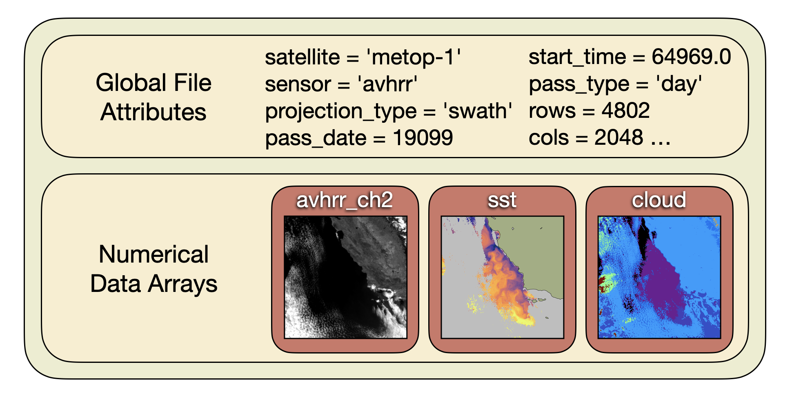

# CoastWatch Data Files

You can access data from CoastWatch in a number of ways:

  - Visually, from a web interface such as [ERDDAP](https://coastwatch.pfeg.noaa.gov/erddap/index.html), the [CoastWatch Data Portal](https://coastwatch.noaa.gov/cw_html/cwViewer.html), or the CoastWatch AOML [OceanViewer](https://cwcgom.aoml.noaa.gov/cgom/OceanViewer/)
  - From your own programming environment, by connecting to an ERDDAP or [THREDDS](https://www.unidata.ucar.edu/software/tds/) server,
  - From your computer, after downloading data files from a server

A downloaded CoastWatch data file is written in a scientific data format that is not recognized by standard image viewers, and the CoastWatch Utilities are useful for manipulating data and creating images from CoastWatch data. CoastWatch data files contain two main types of information:

  - **Global File Attributes** — describe the data source, date, time and location of the data in the file, as well as any other relevant details, like the algorithm used or a reference to a journal article.
  - **Numerical Data Arrays** — hold the scientific data and attributes, such as scaling factor and units, that describe how to use the data values. Each data array has a unique name.

The CoastWatch Utilities allow users to selectively access and extract this information in a number of ways. Two of the main scientific data formats are **Hierarchical Data Format (HDF)** and **Network Common Data Form (NetCDF)**.

---

[« Previous](README.md) · [Next »](Graphical-Versus-Command-Line.md)
