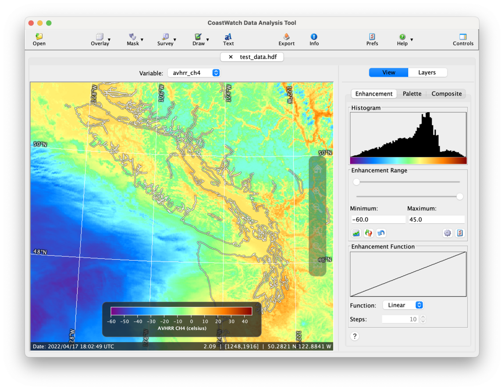
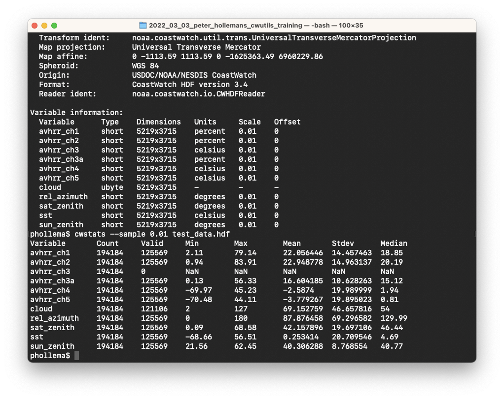

# Graphical Versus Command Line

How you decide to use the CoastWatch Utilities software depends on how you like to work, and what you need to accomplish. There are graphical interface tools to work with data interactively:

There are also command line tools for processing data using a text-only command prompt or scripting language (for example a Windows batch file or Unix shell script) — these are useful for processing many files at once:

---

[« Previous](CoastWatch-Data-Files.md) · [Next »](Software-Functionality.md)
