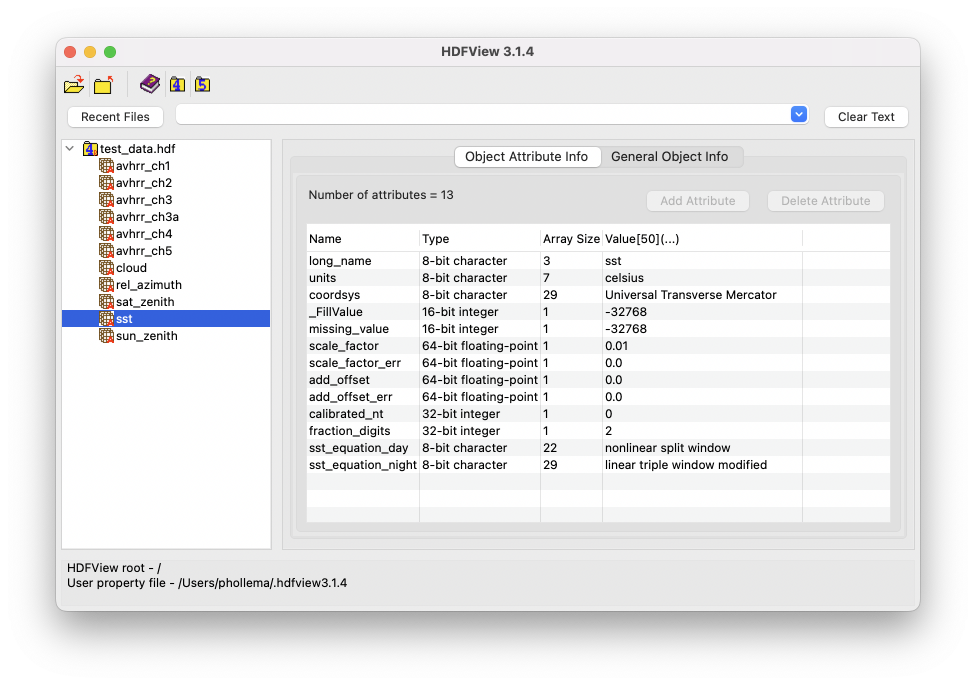

# HDF and NetCDF Software

Sometimes it's useful to use other software packages in tandem with the CoastWatch Utilities to view data file contents. We recommend the [HDFView](https://www.hdfgroup.org/downloads/hdfview/) software to view raw NetCDF and HDF file metadata and scientific values as a table of numbers or an image:

Other notable GUI software:

  - The Unidata [ToolsUI](https://docs.unidata.ucar.edu/netcdf-java/) package, similar to HDFView for viewing the metadata and contents of NetCDF and other data formats. See the [ToolsUI documentation](https://docs.unidata.ucar.edu/netcdf-java/current/userguide/toolsui_ref.html) for details.
  - The [NASA Panoply](https://www.giss.nasa.gov/tools/panoply/) software for creating plots of NetCDF and other format data.

Other command line software:

  - The [NetCDF software library](https://www.unidata.ucar.edu/software/netcdf/) contains the I/O library for NetCDF and useful command line tools like **ncdump**.
  - The [HDF Group](https://www.hdfgroup.org/) distributes I/O library and command line tools for [HDF4](https://www.hdfgroup.org/solutions/hdf4/) such as **hdp**, and [HDF5](https://www.hdfgroup.org/solutions/hdf5/) such as **h5dump**.
  - The [NetCDF Operators](http://nco.sourceforge.net) (NCO) software for command line processing of NetCDF data files (eg: **ncatted** for modifying NetCDF file attributes).

---

[« Previous](Software-Functionality.md) · [Next »](Unit-1-Quiz.md)
