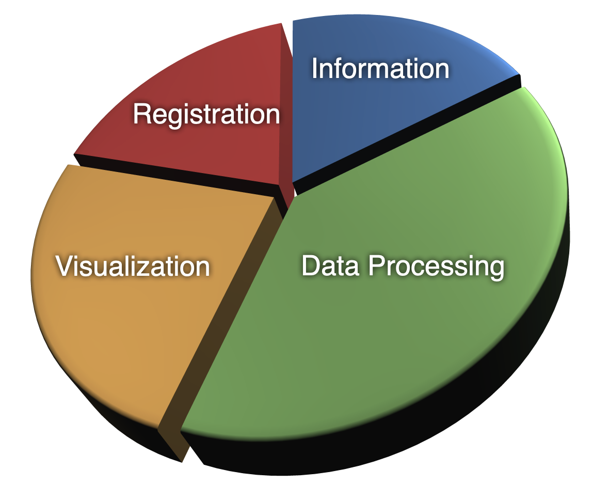

# Software Functionality

The CoastWatch Utilities are designed to meet the needs of many different types of data users. The functionality is divided as follows:

  - **Information and Statistics:** File contents, statistics computations (minimum, maximum, mean, standard deviation), access to global and variable attributes.
  - **Data Processing:** Data format conversions, compositing, generic math, data sampling.
  - **Graphics and Visualization:** Interactive visualization/analysis, batch image rendering, data coverage maps, ancillary graphics.
  - **Registration and Navigation:** Resampling of data from one projection to another, interactive creation of map projections, manual and automatic navigational correction, computation of solar and earth location angles.

---

[« Previous](Graphical-Versus-Command-Line.md) · [Next »](HDF-and-NetCDF-Software.md)
