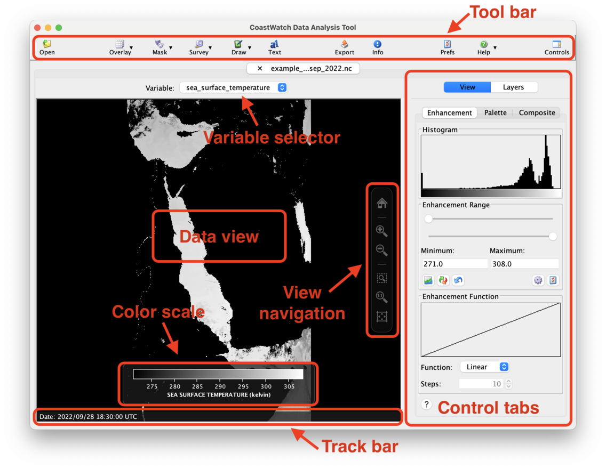
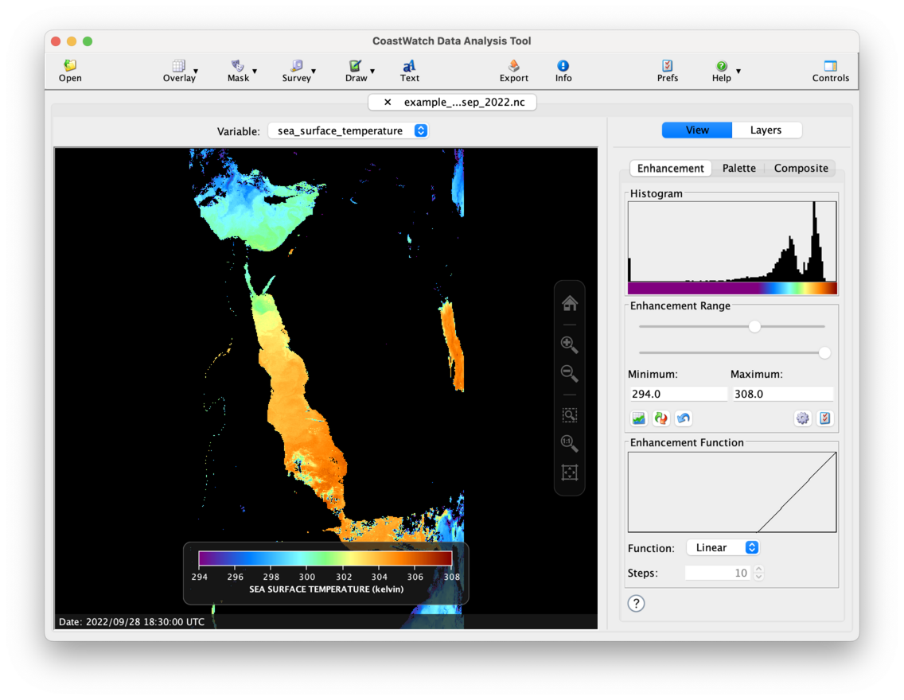

# Color Palette and Enhancement Range

After opening the example data file, your CDAT window should look similar to the following:

You may notice a number of things here:

  - The **data view** is not very colorful or informative — we'll improve that in this exercise.
  - The **variable selector** is used to change the variable shown in the data view.
  - The **control tabs** change _how_ data is displayed in CDAT.
  - The **color scale** shows the mapping of data values to colours. In this case, the units for sea surface temperature (SST) are Kelvin, and the color palette is grayscale.
  - The **view navigation** controls alter the view zoom level and extents.
  - The **track bar** shows the location and data value under the mouse cursor.
  - A **tool bar** at the top has buttons for opening a file, adding an overlay, surveying, drawing, exporting, setting preferences, and getting help.

To improve the usefulness of the data view, try these steps:

  1. Click the **View** button in the control tabs, and then select the **Palette** tab. Select the **HSL256** palette in the **Palette List**.
  2. Select the **Enhancement** tab and use the sliders to set the minimum to 294 and the maximum to 308, or use the text boxes and hit **Enter** after typing each number.

Your CDAT window should now look similar to the following:

###  Bonus exercises:

  - Try choosing other color palettes to see what they look like. You can save your favourite palettes by dragging them from the **Palette List** to the **Favorite Palettes** list.
  - Try clicking the **Help** or **?** button at the bottom of each control tab and read more about what the controls do.
  - Click the other buttons in the enhancement controls (**Normalize**, **Reverse**, **Reset**, etc) to see that they do. Try setting the function to **Step** and while adjusting the number of steps, notice how the color scale changes.
  - Watch a [YouTube video](https://youtu.be/44Ho2BDI1To?list=PL_-bsOLKMYJybI8chOl90HWWd_jTsaO3e) on enhancements and palettes in CDAT.

---

[« Previous](Opening-a-Data-File.md) · [Next »](Data-Overlays.md)
