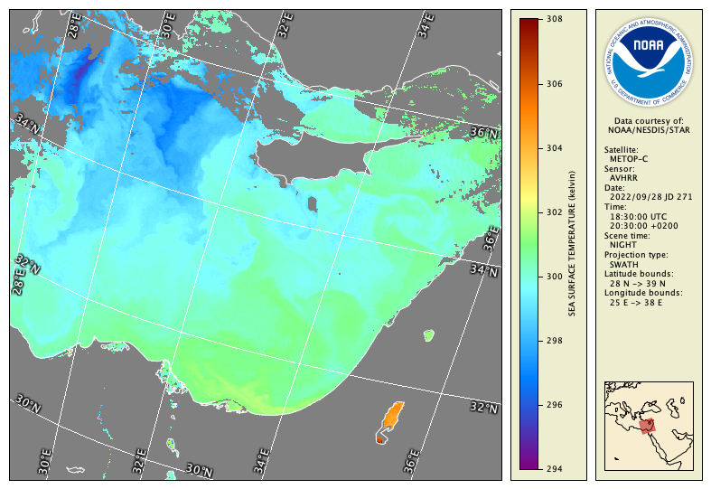

# Data Export

CDAT can export the data view in two different ways:

  - **Color images** — the data view is written to an image with optional color scale and data information legends, used for web page images, printing, or presentation slides.
  - **Scientific data** — the variable values and metadata are written to a data file, used for import into data analysis or GIS software.

To export to a PNG image, zoom and pan to an area of interest and click the  **Export** button on the tool bar. A window will appear with export options — click **OK** to use the defaults, and the data view with legends will be written to the same directory as the sample data file. The PNG file should look similar to the following:

You can also export the full SST variable data, for example to a raw binary file of 32-bit values:

  - Click the    **Export** button.
  - In the export window select the **Binary raster** format.
  - Click **Options** and in the options window select **32-bit float** for the **Data type**.
  - Click **OK** and then **OK** again to export the data. There should now be a 28 Mb .raw file in the same directory as the sample data (ie: 2048 pixels x 3600 lines x 4 bytes per value). This data can be read directly using Matlab, Python, or C code for example (although using the NetCDF library on the original sample data file might be easier). 

###    Bonus exercises:

  - Try clicking **Options** when exporting, and: 
     - Select **Data image only** for just the image with no color scale or information legend
     - Select **No information legend** for just the image and color scale, no legend on the right with logo and information
  - To change the logo used in the information legend to your own, click the    **Prefs** button in the toolbar and set the    **Export** preferences.
  - Try exporting to various different image formats: JPEG, GeoTIFF, PDF.
  - Some combinations of export formats and options can generate an 'unsupported option' error with this sample data file. See if you can generate an error message.
  - Try writing a GIF image and limit the image to only 32 colors — view the resulting file.
  - Read the [CoastWatch Utilities User's Guide](../downloads/cwutils_ug_4_0_0.pdf) Section 3.10 and find out about export formats that may be useful to you.

---

[« Previous](Navigating-Within-the-Data-View.md) · [Next »](Unit-2-Assignment.md)
