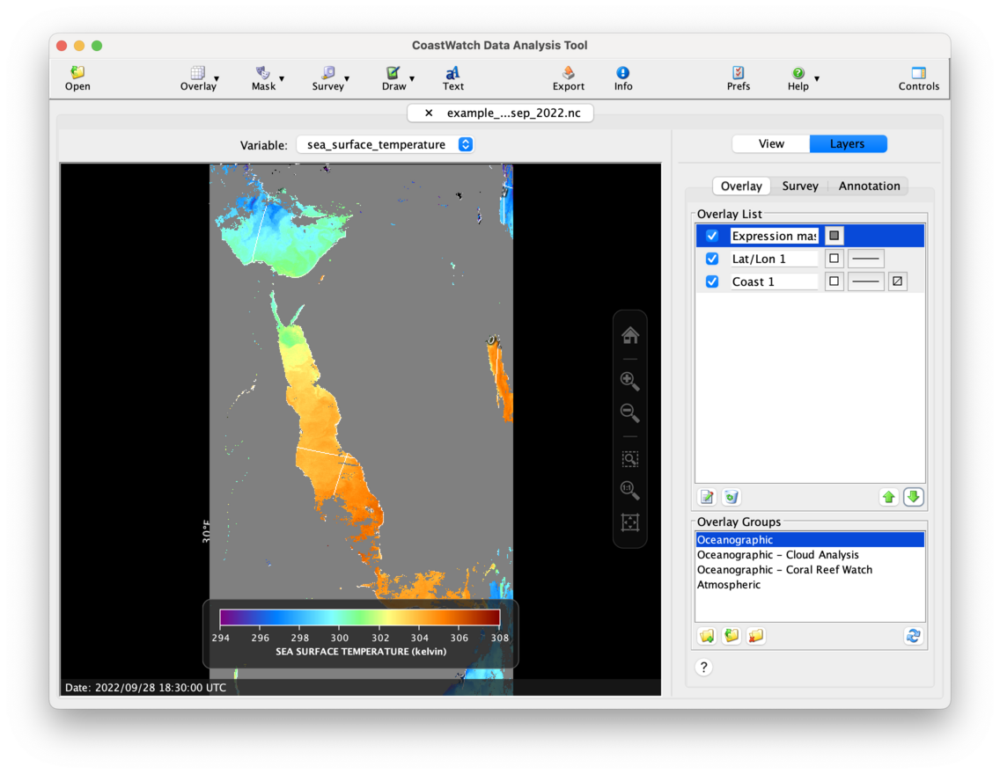

# Data Overlays

CDAT shows graphics in the data view using overlays, which are layered on top of the data image. To show a latitude/longitude grid, coastlines, and to mask low quality SST data, do the following:

  1. Click the    **Overlay** button in the toolbar, then    **Coastlines** to add a coastlines overlay.
  2. Again using the    **Overlay** button, click    **Latitude / longitude grid** to add a grid overlay.
  3. Click the    **Mask** button in the toolbar, and then    **Expression mask**. An overlay properties window will appear — type **quality_level < 5** in the mask expression text field, then click **OK**. The **quality_level** variable contains a rating value for the SST pixels on a scale from 1 (lowest quality) to 5 (highest quality). The expression masks out any pixels with a quality rating less than 5.

  <ins>NOTE</ins>: Step 3 above will only work if you selected the **quality_level** variable when opening the file. If you get an error clicking **OK** on Step 3, close and reopen the file and select both the **sea_surface_temperature** and **quality_level** variables.

Your CDAT window will look similar to the following (notice that the control tabs were automatically updated to show the new overlay layers):

The data view is more useful now but doesn't look correct. The mask data is rendering on top of the coast and grid lines. The **Overlay list** shows the overlay layers as if they're a stack, rendered from bottom to top. Try rearranging the overlays by selecting an overlay (click on its right side) and use the    **Move Up** and    **Move Down** buttons to rearrange the overlays until the CDAT window looks as follows:

###    Bonus exercises:

  - Try changing the overlays' drawing color, line style, or fill color. You can also change the name to help you remember the overlay contents, ie: **Quality mask** instead of **Expression mask 1.**
  - Double-click on the right of the overlay in the list to reveal a properties window with other properties to change. You can also select an overlay and click the    **Edit** button.
  - Try deleting all the overlays in the list using the    **Remove** button. Now, double-click the **Oceanographic** overlay group in the **Overlay Groups** panel. The **Overlay List** now contains some useful overlays (but not a quality mask, though you could add one in the same way as Step 3 above).
  - Watch a [YouTube video](https://youtu.be/0p-38fioJFk?list=PL_-bsOLKMYJybI8chOl90HWWd_jTsaO3e) on data overlays.

---

[« Previous](Color-Palette-and-Enhancement-Range.md) · [Next »](Navigating-Within-the-Data-View.md)
