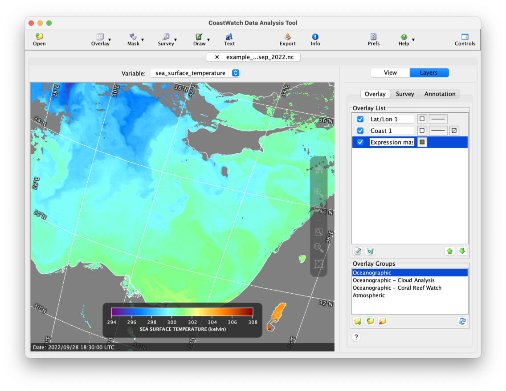
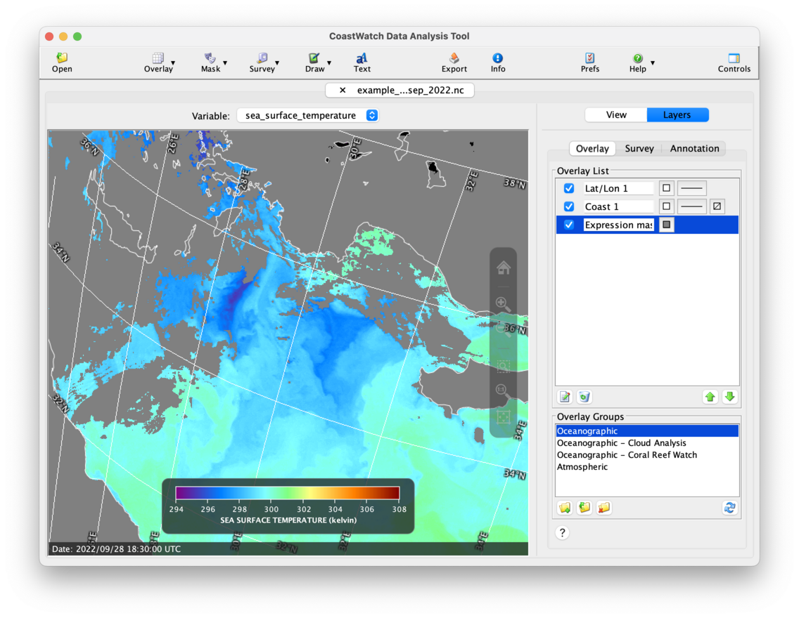
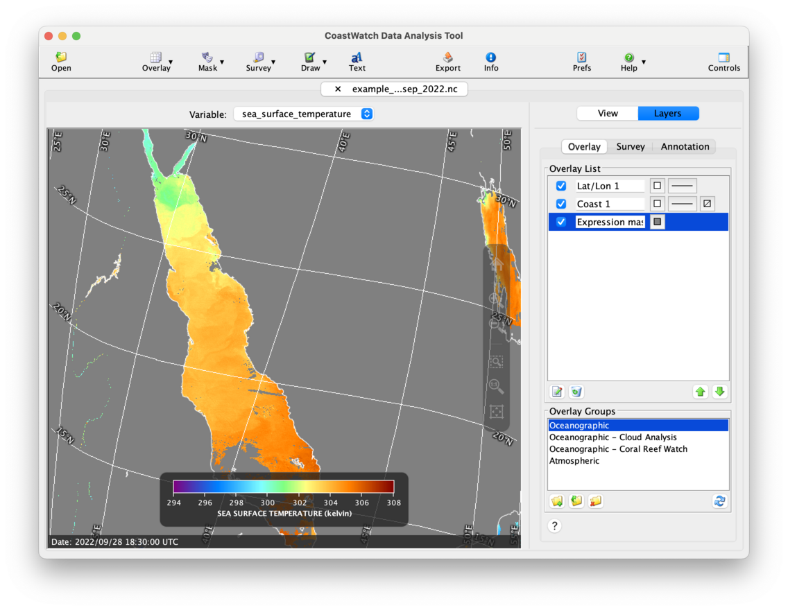

# Navigating Within the Data View

You can navigate within the data view using the navigation buttons built into the data view. Use    **Zoom to selection** (click and drag),    **Zoom in**, or   **Zoom to actual size** to magnify the data view. Try zooming in on the Eastern Mediterranean Sea:

Try panning to the northwest by dragging on the data view:

Use    **Zoom out**,    **Fill window**, or    **Fit image to window** to zoom back out. Try filling the data view window:

###    Bonus exercises:

  - Try using **Full Screen Mode** accessed from the **View** menu, and use the controls to zoom and pan around the data view. Click the **X** at the top left to exit full screen mode.
  - Try changing the data view size either by dragging on the CDAT window edges, or you can use the **Window size** options in the **View** menu. This helps keep the view size the same to more easily export and compare images.
  - Watch a [YouTube video](https://youtu.be/CHUw7wCLBtU?list=PL_-bsOLKMYJybI8chOl90HWWd_jTsaO3e) on basic CDAT components and navigating around in the data view (the YouTube video covers an older version with slightly different view navigation controls).

---

[« Previous](Data-Overlays.md) · [Next »](Data-Export.md)
