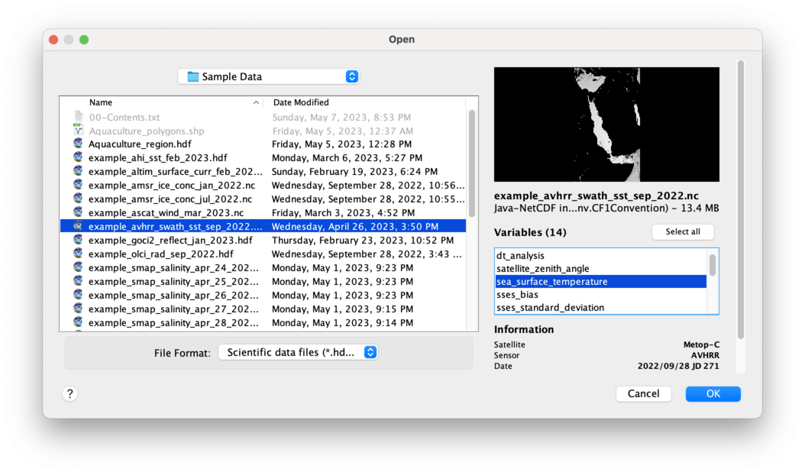

# Opening a Data File

To start the CoastWatch Data Analysis Tool (CDAT), either:

  - Windows: Find it in your Windows Start Menu.
  - Linux: Find it in the bin/ directory of your software installation, or type 'cdat' from a command prompt.
  - Mac: Find it in the bin/ directory of your software installation, inside your Applications folder.

Once started, CDAT shows a blank window, similar to a web browser with no web page loaded. Each file opened in CDAT creates a new tab. There are several ways to open the example sea surface temperature (SST) data file created from Advanced Very High Resolution Radiometer (AVHRR) data:

  - Drag and drop it onto the CDAT window (the easiest method).
  - Click the    **Open** button on the CDAT toolbar and select the file.
  - Use the **File** menu and click **Open**, then select the file.

When the file is selected, CDAT shows the file contents:

To load a set of variables from the data file, select them in the list (you can Ctrl-click to select more than one or ⌘-click on Mac), then click OK to continue. At a minimum for this exercise, select **sea_surface_temperature** and **quality_level**.

###    Bonus exercises:

  - Try loading other variables such as **wind_speed** or **sst_front_position**. 
  - Watch part of a [YouTube video](https://youtu.be/i-_Kg54Xo9I?list=PL_-bsOLKMYJybI8chOl90HWWd_jTsaO3e&t=203) on starting CDAT and loading data from a NOAA 1b AVHRR data file.

---

[« Previous](README.md) · [Next »](Color-Palette-and-Enhancement-Range.md)
