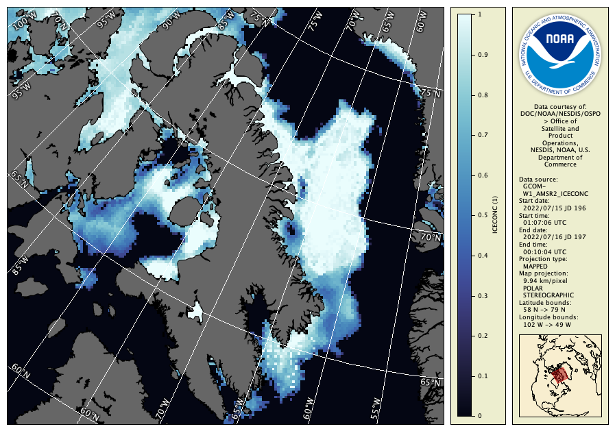

# Unit 2 Assignment

The goal of this assignment is to:

  - Go through the process of discovering the data contained in a data file using CDAT and creating a useful image from it.
  - Learn new features of CDAT not covered yet by using the **Help** menu, clicking the help buttons within the control tabs, and exploring the menu items to see what they do.

Follow these steps:

  1. Take a look at the other sample data files and choose one of interest to you.
  2. Open the file in CDAT and load one or more of the variables.
  3. For your data file, find out: 
      - Satellite and sensor used to create the data
      - Pixel resolution in kilometres at the center
      - Map projection used
  4. Update the default palette and data range used for one of the variables when the data is first loaded, then close the data file and re-open it with the new defaults.
  5. Create an exported image of one of the variables with coast and grid lines.

If you're not sure about what data file to use and what image to create, try to recreate one of these exported images:

Assignment hints:

  - Look for **File Information** and **Preferences** in the **Tools** menu to complete parts of this assignment. The user's guide Section 3.11 on user preferences may also be useful.
  - The **File** menu also has a useful **Open Recent** item.
  - For chlorophyll data, you can use a **Log** enhancement function, 0.01 to 64 for the range, and the **NCCOS-chla** palette.
  - For ice concentration data you can use the **Ocean-ice** palette.
  - Do not simply use the exported data image legends to answer part (3) above. The information is available from within CDAT.

---

[« Previous](Data-Export.md) · [Next »](Unit-2-Quiz.md)

