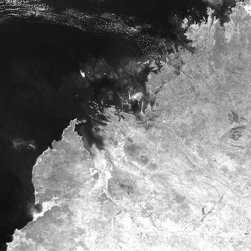
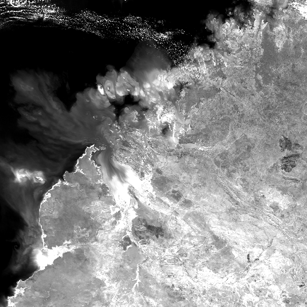
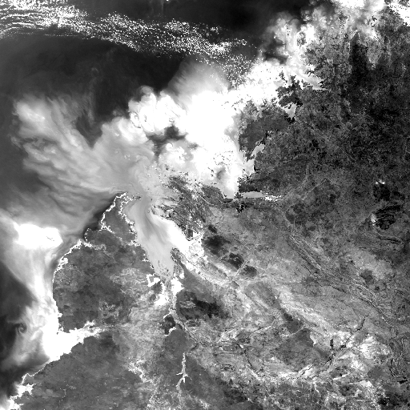
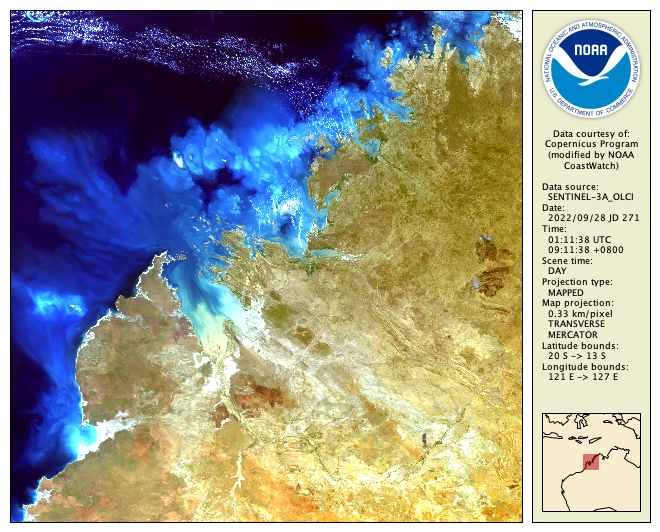
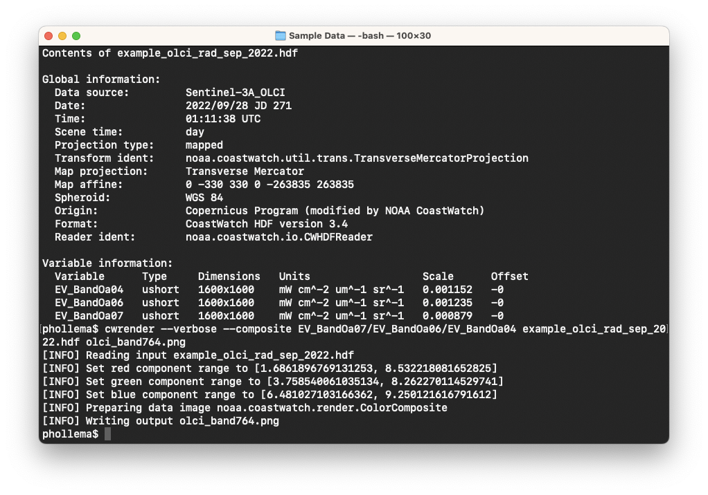
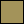

# Color Composite Images

A color composite image is created from three different variables in a data file. For example, try rendering radiance data from the Sentinel-3 Ocean and Land Colour Instrument (OLCI) data file. Use **cwrender** with the default range, function, and palette settings to create a color enhancement of each band as follows (we use `--nolegends` to simplify the images):

`cwrender --nolegends --enhance EV_BandOa07 example_olci_rad_sep_2022.hdf olci_band7.png`  
`cwrender --nolegends --enhance EV_BandOa06 example_olci_rad_sep_2022.hdf olci_band6.png`  
`cwrender --nolegends --enhance EV_BandOa04 example_olci_rad_sep_2022.hdf olci_band4.png`  

You should get images that look like those in the table below.

**Table 3-3:** Sentinel-3 OLCI band radiance data images from cwrender

| Band 7 (620 nm) | Band 6 (560 nm) | Band 4 (442 nm) |
|:--------------- |:--------------- |:--------------- |
|  |  |  |

Now try running **cwrender** to create a composite image with these three same variables using the `--composite` option instead of the `--enhance` option, with legends:

`cwrender --verbose --composite EV_BandOa07/EV_BandOa06/EV_BandOa04 example_olci_rad_sep_2022.hdf olci_band764.png`

Your output image should look like this:

You'll notice that we also used the `--verbose` option in **cwrender**, which shows informational messages while **cwrender** is running, along with what scaling was computed and used for each variable:

Each pixel in the output image was computed by scaling the data from the three input variables and combining the scaled data into the red, green, and blue (RGB) color components of the pixel. For example, a pixel in the center of the data was scaled and converted to an RGB color value as shown in Table 3-4.

**Table 3-4:** Single location pixel scaling example

| Band wavelength | Pixel component | Radiance value (mW/cm2/um2/sr) | Scaling [min .. max] | Scaled value [0 .. 255] |
|:---------------  |:-------------- |:---------------------------------------------------- |:-------------------- |:----------------------- |
| 620 nm (Band 7) | Red | 6.05 | [1.68 .. 8.53] | 163 | 
| 560 nm (Band 6) | Green | 6.35 | [3.75 .. 8.26] | 147 |
| 442 nm (Band 4) | Blue | 7.46 | [6.48 .. 9.25] | 90 |

The resulting RGB value of [163,147,90] shown would create a pixel with this color: 

Just as **cwrender** takes the `--range` and `--function` options for a color enhancement as shown in the previous section, the range and function for scaling the three variables for a color composite can also be controlled using individual options:

`--redrange` `--redfunction`  
`--greenrange` `--greenfunction`  
`--bluerange` `--bluefunction`

Since these can be cumbersome to type, the `--compositehint` option is a shortcut — try this and see what image it produces:

`cwrender --verbose --composite EV_BandOa07/EV_BandOa06/EV_BandOa04 --compositehint true_color_uncorr example_olci_rad_sep_2022.hdf olci_band764_hint.png`

The **cwrender** tool color composite mode can also be used with variable data from non-visible spectrum sensor bands to create false color composites, and accepts all the overlay options like `--coast` and `--grid` shown in the previous section.

###    Bonus exercises:

  - Look at the manual page for **cwrender** and see what other values `--compositehint` can take.
  - Render the data from the GOCI-II data file to a true color composite. (Hint: the data is in reflectance units in the range [0..1], not radiance units).
  - Try rendering the OLCI data using one of the command lines above but at full resolution using a magnification option, for example `--magnify -16.5/124/1`.

---

[« Previous](Color-Enhancement-Images.md) · [Next »](Colored-Vector-Images.md)
