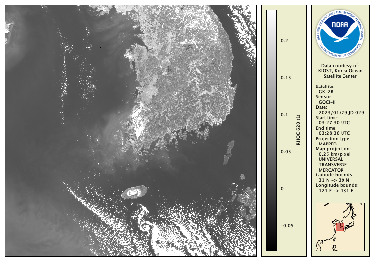
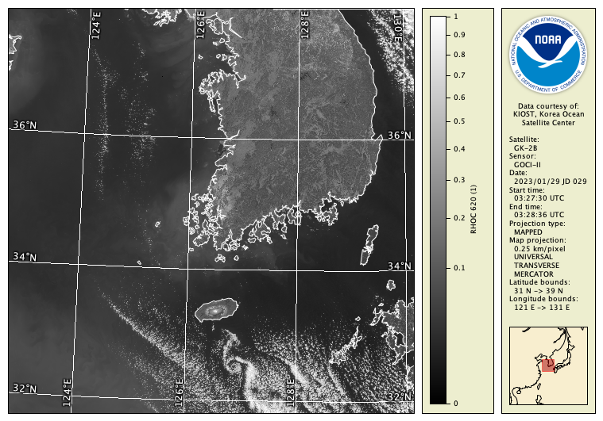
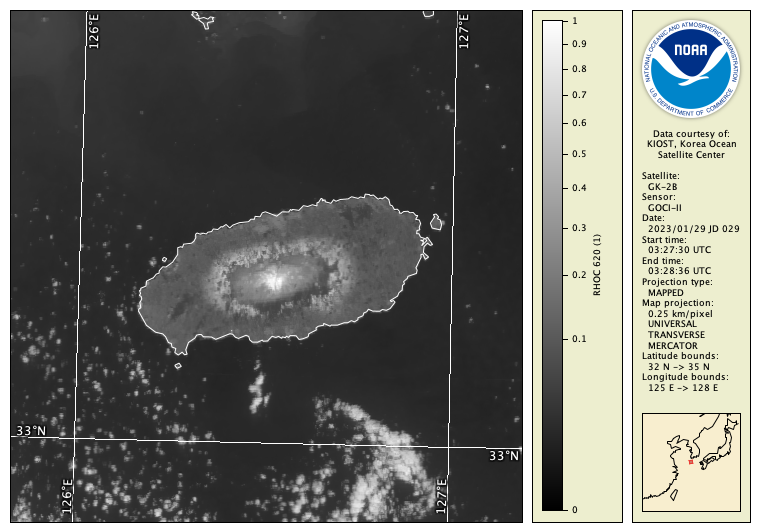
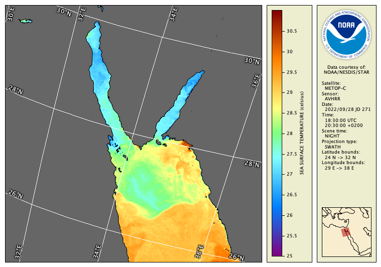
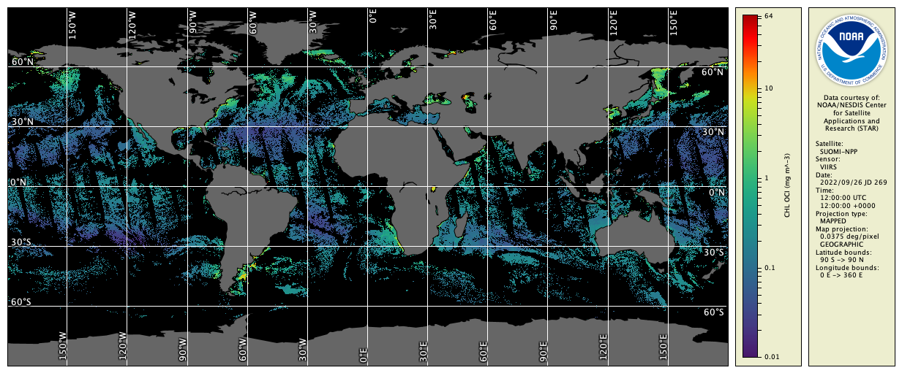
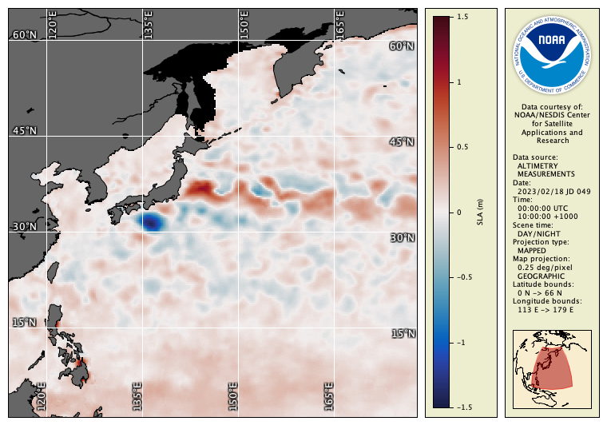

# Color Enhancement Images

The simplest type of image to create is a color enhancement. From the terminal, type:

`cwrender --enhance RhoC_620 example_goci2_reflect_jan_2023.hdf rhoc_620.png`

You should have a new PNG file in your directory that looks like this:

The legends on the right indicate that this is a 620 nm reflectance image from the GOCI-II sensor and the context image at the bottom right shows that it covers the Korean Peninsula. By default **cwrender** computes statistics from the variable data and linearly scales the data values to colors using a grayscale palette and a minimum/maximum range based on the mean and standard deviation of the data values. This is a reasonable heuristic that gives us an initial browse image with some detail. 

To revise the image, let's add the following function and range options:

`--function gamma --range 0/1`

This properly scales the reflectance in the range [0..1] measured by the sensor for the non-linear way that humans perceive light intensity. Some additional options add coastlines and grid lines:

`--coast white --grid white`

To combine all these options, enter this on the command line:

`cwrender --enhance RhoC_620 --function gamma --range 0/1 --coast white --grid white example_goci2_reflect_jan_2023.hdf rhoc_620_new.png`

The resulting image should look like this:

Suppose that we want to show the data at its full resolution, ie: 1:1 — we can add a magnification option that specifies the latitude, longitude, and magnification factor:

`--magnify 33.4/126.5/1`

The magnification factor specifies how large each data pixel should by rendered in the resulting image, ie: the ratio of image to data pixels. For example, a factor of 1 shows the data at full resolution, 2 shows the data zoomed in by 2x, 0.5 shows the data zoomed out by 2x, etc. Without any magnification option at all, **cwrender** fits all of the data into the output image. Adding the option above will create this image:

We'll give several examples now of **cwrender** command lines for creating color enhancement images from other data files, and general option recommendations in Table 3-2.

### Example 1 — Sea surface temperature in the Red Sea

`cwrender --units celsius --enhance sea_surface_temperature --palette HSL256 --range 25/31 --magnify 28/34/1 --coast black/gray40 --grid white example_avhrr_swath_sst_sep_2022.nc sst_red_sea.png`

### Example 2 — Global chlorophyll-a data

`cwrender --enhance chl_oci --palette NCCOS-chla --function log --range 0.01/64 --coast black/gray40 --grid white example_viirs_chlor_sep_2022.nc chlora_global.png`

### Example 3 — Sea level anomaly in the North Pacific

`cwrender --magnify 33/146/2 --enhance sla --palette Ocean-balance --range -1.5/1.5 --coast black/gray40 --grid white example_altim_surface_curr_feb_2023.nc north_pacific_sla.png`

**Table 3-2:** Command line option recommendations for cwrender

| Option | Default | Recommendations |
|:------ |:--------|:--------------- |
`--palette` | BW-Linear | SST: HSL256, Ocean-thermal  Chlorophyll: NCCOS-chla, Chlora-1, Blue-Red  Radiance, reflectance: BW-Linear  Wind: Wind-0-50  Ice concentration: Ocean-ice |
`--range` | Automatic | SST: 0/35  Chlorophyll: 0.01/64  Radiance, reflectance: 0/1  Wind: 0/50  Ice concentration: 0/1 |
`--function` | Linear | Chlorophyll: log  Radiance, reflectance: gamma  Others: linear |
`--units` | From data variable | SST: Celsius, Fahrenheit  Wind: knots, m/s |

###    Bonus exercises:

  - Look at the manual page for **cwrender** and discover what other overlay options are available, for example for political lines, bathymetric contours, and expression masks. For example, try using `--political red` .
  - Try using the `--size` option to alter the output image size — the default is 512 pixels.
  - Change the output file name to end in .pdf, .jpg, or .tif and inspect the output. Notice the difference in output file sizes.
  - Try running with `--nolegends --size full` to render just the data with no legends at full resolution. 
  - Run **cwrender** with just `--palettelist` and no other options or parameters to see what it prints.
  - To find out what options were used with **cwrender** to create an output image, try this at the command line:  
`strings image.png | grep cwrender` (Unix)  
`format-hex image.png | more` (Windows PowerShell)

---

[« Previous](Rendering-Images-cwrender.md) · [Next »](Color-Composite-Images.md)
