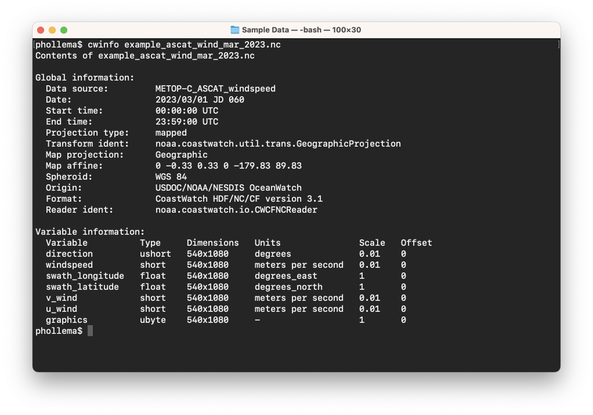
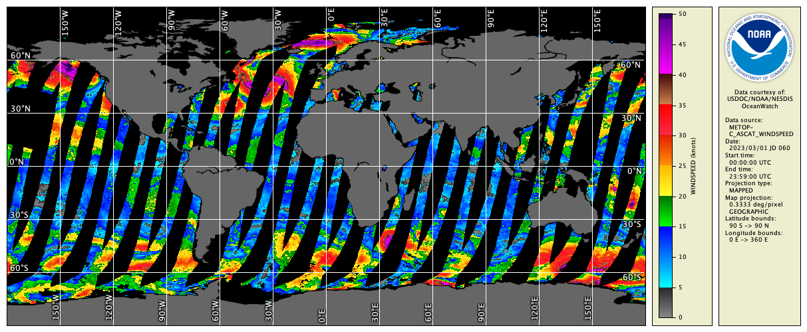
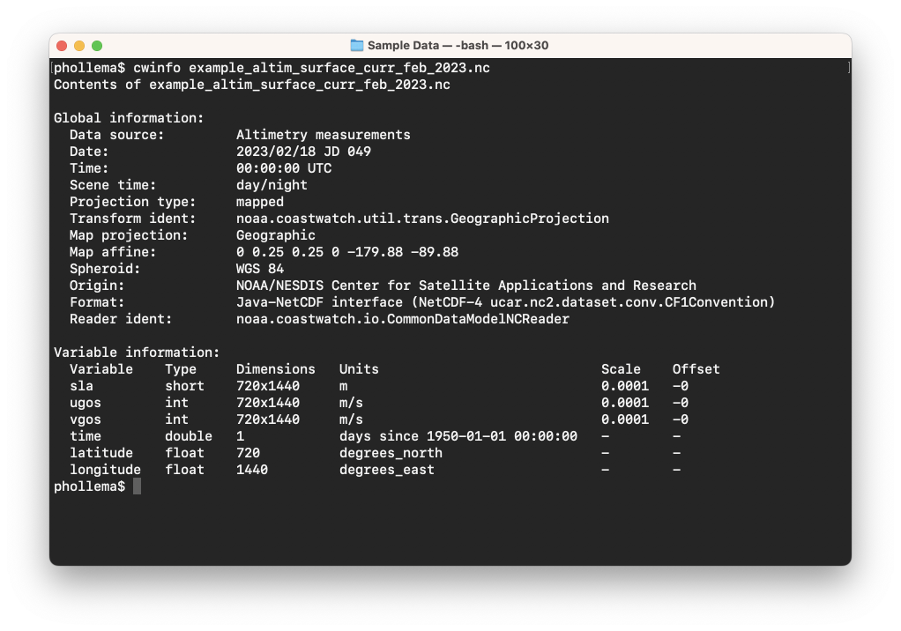
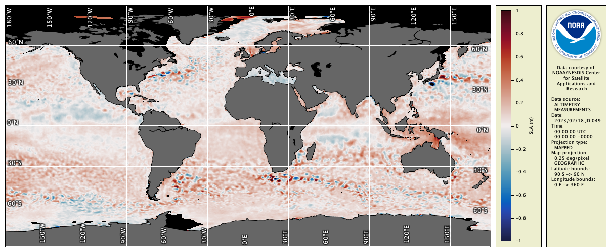
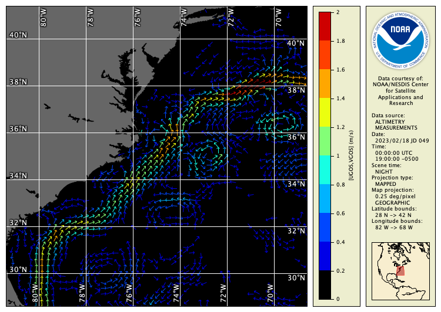

# Colored Vector Images

Colored vectors are often used to represent [magnitude, direction] vector data such as ocean currents and surface winds. To display vector data, the **cwrender** tool has a second mode for the `--enhance` option that was covered previously. To summarize, the two modes are:

  - **Color enhancement** — When passed a single variable name, it creates a color enhancement image of that one variable. This mode was demonstrated in the [Color Enhancement Images](Color-Enhancement-Images.md) section.
  - **Colored vector enhancement** — When passed two variable names, it creates an image of color-enhanced arrows or wind barbs on a solid background. This mode is covered in this section.

We'll look at rendering two types of data in the next exercises.

### Ocean Surface Winds

Let's look at the surface wind data file `example_ascat_wind_mar_2023.nc` which contains data from the MetOp-C satellite Advanced Scatterometer (ASCAT) instrument. The instrument uses radar to measure backscatter to determine speed and direction of winds over the surface of the oceans. Take a look at the file contents with **cwinfo**:

You can see that the data file contains both **windspeed** in m/s and **direction** in degrees. As shown previously, we can pass the **cwrender** tool just a single variable — the windspeed — and enhance with a purpose-built wind palette as follows:

`cwrender --enhance windspeed --palette Wind-0-50 --range 0/50 --units knots --coast black/gray40 --grid white example_ascat_wind_mar_2023.nc windspeed.png`

Note the use of `--units knots` because wind is often displayed in knots. You should see this resulting image:

Now to create a vector image, we name both the magnitude and direction variables and add an option to draw proper weather map wind barbs rather than the default arrows:

`--enhance windspeed/direction`  
`--enhancevector magdir/barb`

We also magnify some area of interest to show the vectors properly, and specify a black background:

`--magnify 35/-125/12`  
`--background black`

Putting this all together:

`cwrender --enhance windspeed/direction --enhancevector magdir/barb --magnify 35/-125/12 --background black --palette Wind-0-50 --range 0/50 --units knots --coast black/gray40 --grid white example_ascat_wind_mar_2023.nc windbarbs.png`

You should see this wind barb plot off the coast of California:

Wind barbs follow a convention as described by the Wikipedia page on meteorology station data diagrams:

<https://en.wikipedia.org/wiki/Station_model#Plotted_winds>

### Ocean Surface Currents

Now's look at the ocean currents data file `example_altim_surface_curr_feb_2023.nc` and render the vector data as color enhanced arrows. As before, look at the contents of the file:

The file contains **sla** (sea level anomaly) in meters, and ocean current data as two vector components:

  - **ugos** — Zonal (eastward) component of the geostrophic current in m/s
  - **vgos** — Meridional (northward) component of the geostrophic current in m/s

We can render the sea level anomaly data as a color enhancement as follows:

`cwrender --enhance sla --palette Ocean-balance --range -1/1 --coast black/gray40 --grid white example_altim_surface_curr_feb_2023.nc global_sla.png`

which results in this image:

Using a command similar to the one above for surface winds, we can render the ocean current vectors:

`cwrender --enhance ugos/vgos --magnify 35/-75/10 --background black --palette Blue-Red --range 0/2 --function step10 --coast black/gray40 --grid white example_altim_surface_curr_feb_2023.nc nw_atlantic_currents.png`

You should see the following image:

Note the use in the command of these options:

  - `--magnify 35/-75/10` — This centers the image on [35°N, 75°W], with a magnification factor of 10 to allow space for each arrow.
  - `--function step10` — This specifies a linear step function with 10 steps for the color bar.

  
###    Bonus exercises:

  - Try rendering ocean currents in other places. You can see in the sea level anomaly image that there are larger anomalies off the east coast of Japan and south of Africa — these are good candidates for strong currents and eddies.
  - Some of the useful metadata for these data files is not printed by the **cwinfo** tool. Try loading the data in **CDAT** and looking at the file information. If you want to see file information in the terminal, try running `ncdump -h file.nc` on these files. (Hint: the **ncdump** command is part of the [NetCDF software library](https://www.unidata.ucar.edu/software/netcdf/).)
  - Add `--size 1000` to the vector rendering command to show a larger area.
  - Try rendering the ASCAT wind data as colored arrows instead of barbs — oceanographers may be more familiar with arrows for flow direction. (Hint: use the **u_wind** and **v_wind** variables and remove the **\--enhancevector** option.)

---

[« Previous](Color-Composite-Images.md) · [Next »](Hybrid-Images.md)
