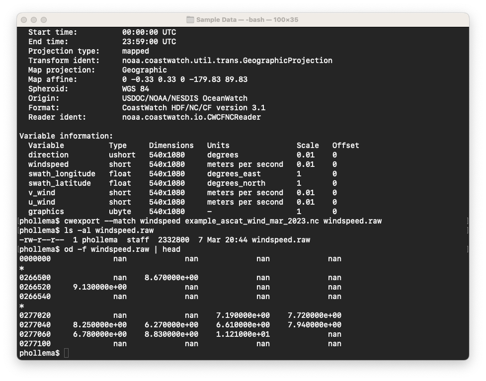
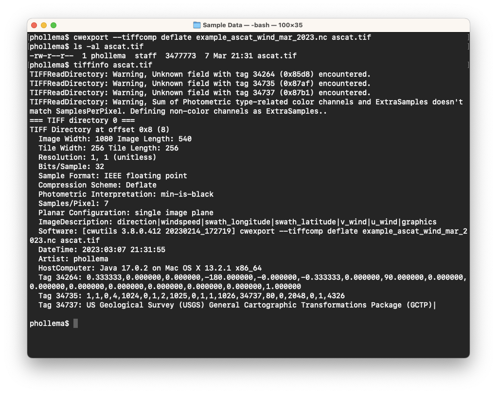

# Data Export (cwexport)

The **cwexport** tool converts HDF and NetCDF data files into various formats:

  - **Binary** — raw bytes of data of various native types, ie: 8-bit byte, 16-bit short, 32-bit float
  - **Text** — lines of latitude, longitude, and data value
  - **ArcGIS** — binary format for use in the ESRI ArcGIS software
  - **NetCDF** — NetCDF version 3 and 4 files (from HDF input files)
  - **GeoTIFF** — 32-bit float TIFF files with georeferencing tags

Take for example the MetOp-C ASCAT wind data file `example_ascat_wind_mar_2023.nc` — suppose we need to import the windspeed data into an analysis software package without using NetCDF format. Try exporting the windspeed to a 32-bit float data file:

You can see above that the output file `windspeed.raw` has the expected size of 540 x 1080 x 4 = 2332800 bytes. A dump of the binary file contents (using the Unix `od` command) shows many NaN (Not a Number) values with some valid windspeed values (8.67 m/s, 9.13 m/s, …) just as in the original NetCDF file. Now try the same thing with a text output file and check the results:

You can see that the output is much larger (14 Mb) and that each line is a latitude, longitude, and windspeed value (note the same windspeed values as the binary file).

Try exporting the data to a GeoTIFF and inspect the results (we used the `tiffinfo` command from the [LibTIFF package](http://simplesystems.org/libtiff)):

###    Bonus exercises:

  - Export just the **IceConc** variable in the `example_amsr_ice_conc_jan_2022.nc` data file to a GeoTIFF using no TIFF compression. Verify using the `tiffinfo` command.
  - Look at the examples in the **cwexport** man page to get ideas for other types of data exporting.
  - Try exporting the `example_ahi_sst_feb_2023.hdf` data file to both NetCDF 3 and 4 and look at the resulting file sizes.

---

[« Previous](Sampling-Locations-cwsample.md) · [Next »](Unit-3-Assignment.md)
