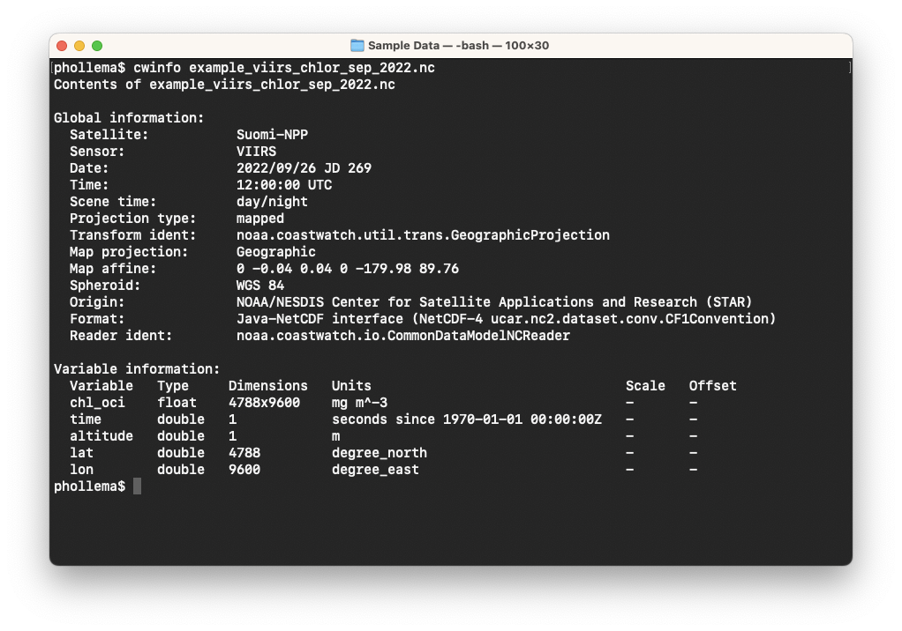
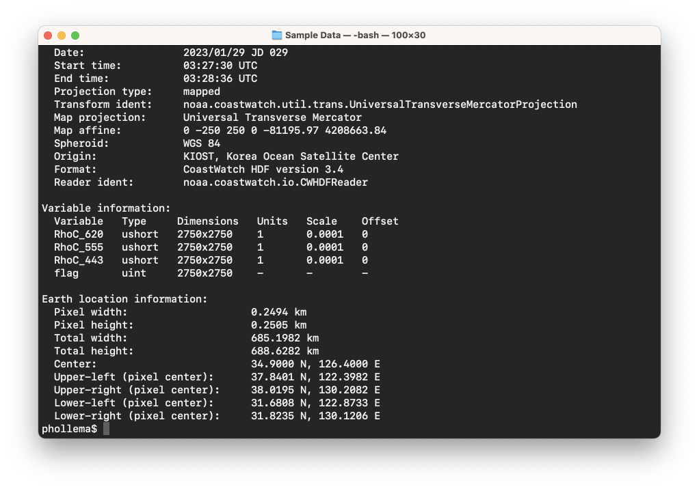

# Data File Contents (cwinfo)

Once you start a terminal session, change directories to where you saved the example data files and type:

`cwinfo example_viirs_chlor_sep_2022.nc`

You should see the file contents printed:

The **cwinfo** tool lists global file attributes and the data variables in the file in a human-readable format. The tool also has a useful mode that prints the coordinates of the edges of the data, and its resolution:

` cwinfo --transform example_goci2_reflect_jan_2023.hdf`

You should see the following:

You'll notice throughout the command line examples that all tools have a similar behaviour:

  - An input file name and possibly output file name are required.
  - There are optional parameters, both in a long form double-dash like `--transform` and a short form single-dash like `-t` .
  - Some optional parameters take values, for example `--locFormat DDMM` in cwinfo, where as others are just switches like `--verbose`.
  - If you type `-h` after the command it will print a usage summary
  - If you type `--version` after the command it will print a version number, for example `cwutils 3.7.1.1230 20220718_175207`

###    Bonus exercises:

  - Try typing `cwtools` (in version 3.8.0 and later) at the command line to list all the tools and their function. This is useful if you forget the tool names.
  - Look at the **cwinfo** manual page, either in the user's guide or the Unix man pages.
  - Find out how to make **cwinfo** print out its progress when the tool is trying to identify the file format.

---

[« Previous](README.md) · [Next »](Rendering-Images-cwrender.md)
