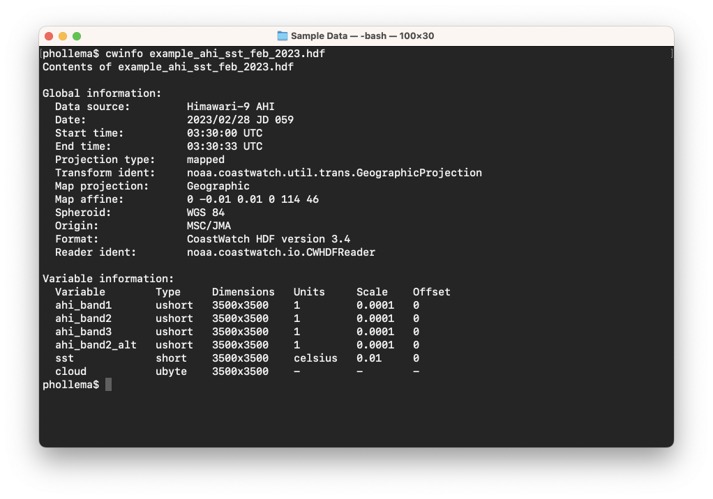
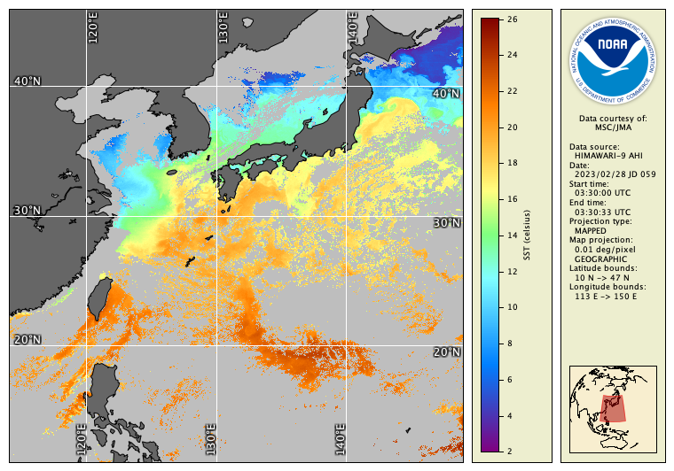
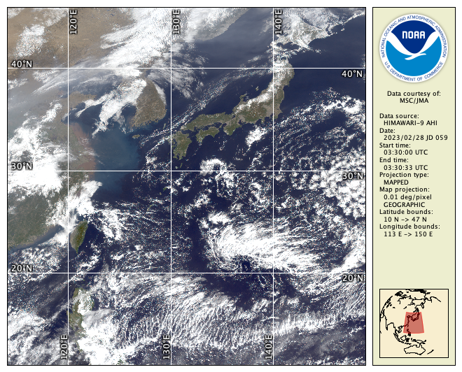
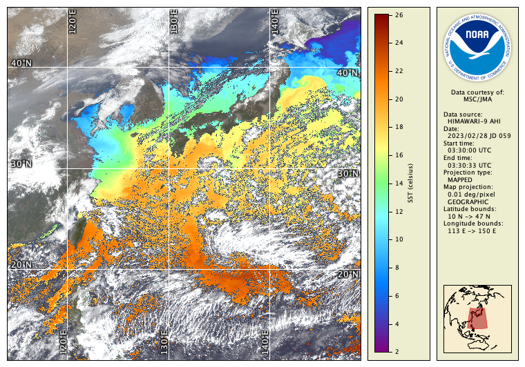
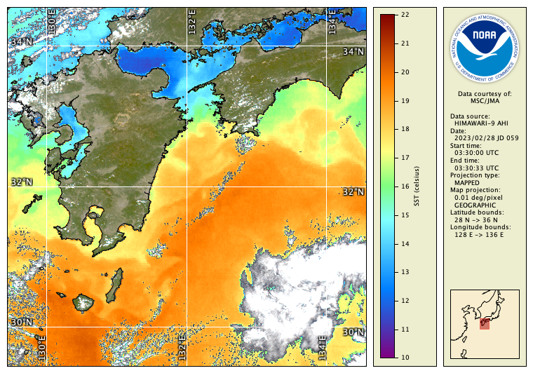

# Hybrid Images

The **cwrender** tool can create a hybrid of a color enhancement and a color composite, using the options for both. For example, we'll use the Himawari-9 Advanced Himawari Imager (AHI) data file which contains data from some of the visible AHI bands, as well as SST data derived from the thermal bands:

Use the following command to create a color enhancement of the SST data in the file (**NOTE:** if using the <ins>Windows command prompt</ins>, you may need to omit the spaces and quotes around the expression mask parameter, ie: use `--exprmask cloud!=0/gray`, or you may receive an error saying "cannot determine output format"):

`cwrender --enhance sst --palette HSL256 --range 2/26 --exprmask "cloud != 0"/gray --coast black/gray40 --grid white example_ahi_sst_feb_2023.hdf h9_sst.png`

Note the use of the expression mask `--exprmask` option — the **cloud** variable is tested and for values than are non-zero, the SST data is masked to gray. This is often not necessary because SST data is commonly pre-masked (but this serves as a good example of expression masking). You should get the resulting image:

Now try creating a color composite using bands 1, 2, and 3 of the AHI sensor using **ahi_band1**, **ahi_band2_alt**, and **ahi_band3**:

`cwrender --composite ahi_band3/ahi_band2_alt/ahi_band1 --compositehint true_color_uncorr --grid white example_ahi_sst_feb_2023.hdf h9_rgb.png`

This is the resulting image:

Note that we used the composite rendering hint `--compositehint true_color_uncorr` because the visible AHI band data is in reflectance units but is not corrected for sun angle or atmosphere. You can now create a hybrid of these two images by combining the **cwrender** options, but use `--hybridmask` rather than `--exprmask` to specify where the SST data should be transparent (see note above if you're using the Windows command prompt):

`cwrender --enhance sst --palette HSL256 --range 2/26 --hybridmask "cloud != 0" --composite ahi_band3/ahi_band2_alt/ahi_band1 --compositehint true_color_uncorr --grid white example_ahi_sst_feb_2023.hdf h9_hybrid.png`

The resulting image looks like this:

Add a `--magnify` option to see the full resolution ~1 km data:

`cwrender --magnify 32/132/1 --enhance sst --palette HSL256 --range 10/22 --hybridmask "cloud != 0" --composite ahi_band3/ahi_band2_alt/ahi_band1 --compositehint true_color_uncorr --grid white --coast black example_ahi_sst_feb_2023.hdf h9_hybrid_mag.png`

  
###    Bonus exercises:

  - What is the ocean temperature around Yakushima Island in February?
  - What happens when you use the **ahi_band2** variable in the color composite instead of **ahi_band2_alt**? See [Murata et al (2018)](https://www.jstage.jst.go.jp/article/jmsj/96B/0/96B_2018-049/_article) for the explanation and solution.
  - Try rendering bathymetric contours in the last magnified image, for example `--bath black/100/200/500/1000/2000/5000`.
  - Read the Unix man page or the user's guide entry for the **hdatt** tool (part of the CoastWatch Utilities, but not covered in this module). Use the example in the manual page to dump the global metadata of the Himawari-9 HDF data file. You can see some of the commands and equations used to create the data file.

---

[« Previous](Colored-Vector-Images.md) · [Next »](Statistics-Computations-cwstats.md)
