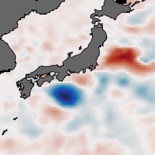
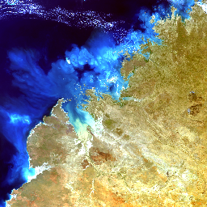
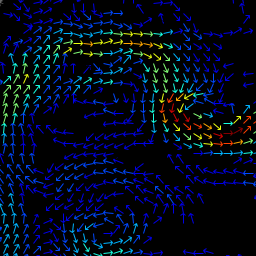
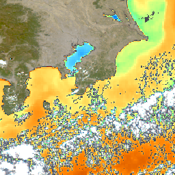

# Rendering Images (cwrender)

The **CoastWatch Data Analysis Tool (CDAT)** covered in a different module of this course lets you view data files interactively on the screen. The **cwrender** tool has many of the same capabilities as CDAT for rendering: coast lines, land mask, grid lines, topography, bathymetry, and ESRI shapefile overlays, custom region enlargement, and units conversion. The output formats supported include PNG, JPEG, GIF, GeoTIFF, and PDF. The **cwrender** tool can create several types of output as shown in Table 3-1. We will give examples of all these output types in the next sections.

**Table 3-1:** Types of output created by cwrender

| Description | Example&nbsp;image |
|:----------- |:-------------------|
| **Color enhanced images** from a single data variable, eg: SST, reflectance, chlorophyll, windspeed, etc. |  |
| **Composite red/green/blue images** from three variables, eg: false color, true color |  |
| **Colored vector images** from two component variables, eg: wind direction, ocean currents |  |
| **Hybrid images** combining a composite RGB and color enhanced image |  |

---

[« Previous](Data-File-Contents-cwinfo.md) · [Next »](Color-Enhancement-Images.md)
