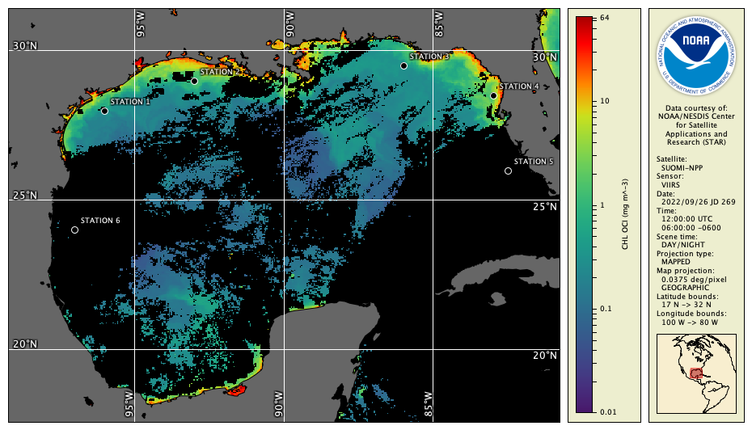

# Sampling Locations (cwsample)

It's often necessary to compare data from a satellite sensor to data from in-situ measurements. The **cwsample** tool helps performs this function by taking as input a geographic (latitude, longitude) point or set of points and extracting the data values found at those points in the file.

Taking a look at the VIIRS chlorophyll data file `example_viirs_chlor_sep_2022.nc` in the Gulf of Mexico, suppose that there are six stations with in-situ sample data as shown here:

The **cwsample** tool can extract data at these stations with the following command:

`cwsample --samples gom_stations.txt example_viirs_chlor_sep_2022.nc gom_samples.txt`

The `gom_stations.txt` file contains the input station locations as lines of latitude / longitude values:
  
    28 -96  
    29 -93  
    29.5 -86  
    28.5 -83  
    26 -82.5  
    24 -97

The `gom_samples.txt` file contains the output sample values and locations:
  
  
    28 -96 0.3442  
    29 -93 1.0987  
    29.5 -86 0.2949  
    28.5 -83 1.9696  
    26 -82.5 NaN  
    24 -97 NaN

With a few more options to **cwsample**, the output rows can be imported into a spreadsheet with column headers and comma-separated values (CSV):

`cwsample --samples gom_stations.txt --header --delimit "," example_viirs_chlor_sep_2022.nc gom_samples.txt`

This command produces to following output file:
  
    latitude,longitude,chl_oci  
    28,-96,0.3442  
    29,-93,1.0987  
    29.5,-86,0.2949  
    28.5,-83,1.9696  
    26,-82.5,NaN  
    24,-97,NaN

  
###    Bonus exercises:

  - Read the **cwsample** Unix man page or user's guide section. 
  - Add an option to the **cwsample** command line to mark the invalid samples (marked with NaN to indicate no data) as -999 instead. 
  - Add an option to also output the image (row, column) coordinates.
  - Run the same **cwsample** command line, but on the `example_altim_surface_curr_feb_2023.nc` data file instead. See how the output is different — notice how many columns there are now.

---

[« Previous](Statistics-Computations-cwstats.md) · [Next »](Data-Export-cwexport.md)
