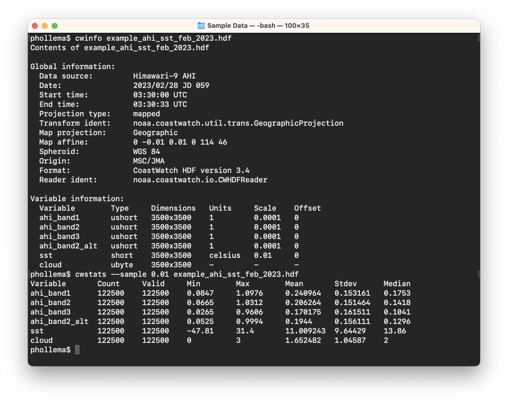

# Statistics Computations (cwstats)

The **cwstats** program is a command line tool that calculates a simple set of statistics for each variable in a data file. For example on the Himawari-9 AHI data file, try showing the contents and then computing statistics on 1% of the data (sampling factor = 0.01):

As shown above, the tool calculates: 

  - **Count** — the count of total data values sampled
  - **Valid** — the number of valid (not missing) data values
  - **Minimum** — the minimum data value
  - **Maximum** — the maximum data value
  - **Mean** — the average data value (arithmetic mean)
  - **Standard deviation** — the standard deviation from the mean, ie: square root [1/N * ∑ (x - mean(x))2 ] 
  - **Median** — the median data value (middle value of sorted data values)

The main use for **cwstats** is a quick assessment of data quality and data value range (also a rough check of equality between data files). The statistics can be limited by:

  - **Geometry** — rectangle, circle, and polygon
  - **Variable** — match variables to an expression
  - **Sampling factor** — percentage or data stride

Try the following options one at a time on the same data file:

  - `--match 'ahi.*'` — Only compute on the AHI band data (using a [POSIX extended regular expression](https://en.wikipedia.org/wiki/Regular_expression#POSIX_basic_and_extended))
  - `--stride 5` — Sample every 5th value in each dimension
  - `--region 28/131/50` — Only compute on pixels within a 50 km radius of [28°N, 131°W]

###    Bonus exercises:

  - Read the Unix man page or user's guide on the **cwstats** tool.
  - Create a text file to be used with the **\--polygon** option that draws a polygon around only a portion of the data. Run **cwstats** with your text file on one of the other example data files and see if the output makes sense.
  - You can create a `--match` expression for any series of variables using the format: `'(var1|var2|var3 ... )'`. Run **cwstats** for just the **sst** and **cloud** variables in the AHI data file using this expression format.

---

[« Previous](Hybrid-Images.md) · [Next »](Sampling-Locations-cwsample.md)
