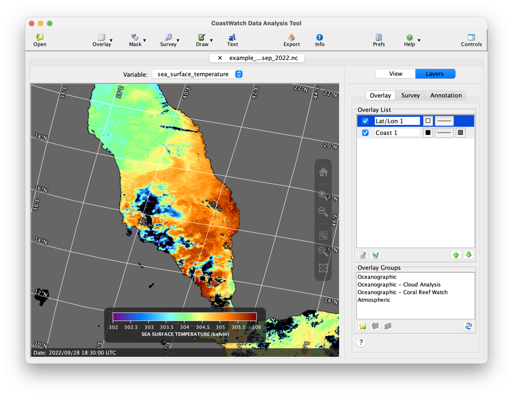

# Bitmask Overlays

A bitmask overlay masks data with a single color using a quality variable and a mask value. Pixels in the quality variable that contain any of the bits in the mask value are masked.

Let's start by opening the AVHRR SST data file `example_avhrr_swath_sst_sep_2022.nc` in CDAT, loading the **sea_surface_temperature** and **l2p_flags** variables, and zooming in on the southern Red Sea:

For the image above, we also changed the default palette and enhancement range, and added coastlines and grid lines. Notice that there are black areas in the image that may indicate cloud contamination in the SST data, for example north of [16°N, 40°E]. You can visually mask the cloud pixels using a **bitmask overlay** and the data from the **l2p_flags** variable, as follows:

  1. Click the    **Mask** button in the toolbar, and then    **Single layer bitmask**. 
  2. An overlay properties window will appear — select **l2p_flags** as the mask variable, and then set the integer mask value to 49152 and click **OK**.
  3. Move the new bitmask overlay to the bottom of the list using the    **Move Down** button.

You should now see the following:

The integer mask value 49152 was used because the **l2p_flags** variable stores the clear/cloudy status bits in bits 15 and 16. In binary, 49152 is 1100 0000 0000 0000, ie: 16384 + 32768.

###    Bonus exercises:

  - Use the **File Information** in the **Tools** menu to look at the raw metadata for the **l2p_flags** variable and see what the various flag bits contain. Look at the **comment**, **flag_masks** and **flag_meanings** attributes. Which bit encodes sun glint? Which bit encodes ocean/land? 
  - Add a new bitmask overlay that uses the **l2p_flags** to mask land as red.
  - See the user's guide Section 3.5.1 on types of overlays, and read about bitmask overlays and how they work.

---

[« Previous](Mask-Overlays.md) · [Next »](Multilayer-Mask-Overlays.md)
