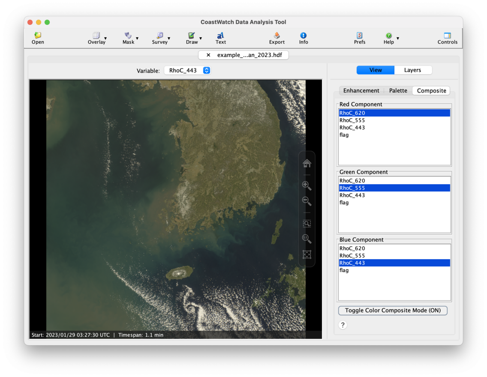
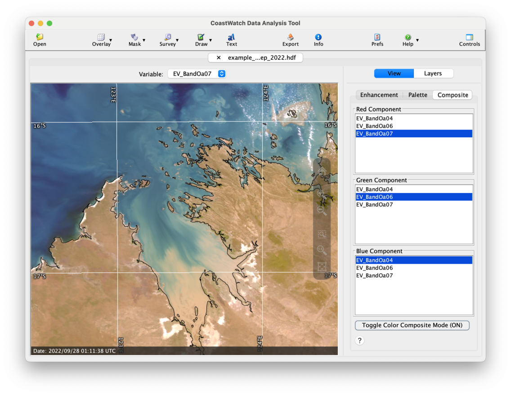
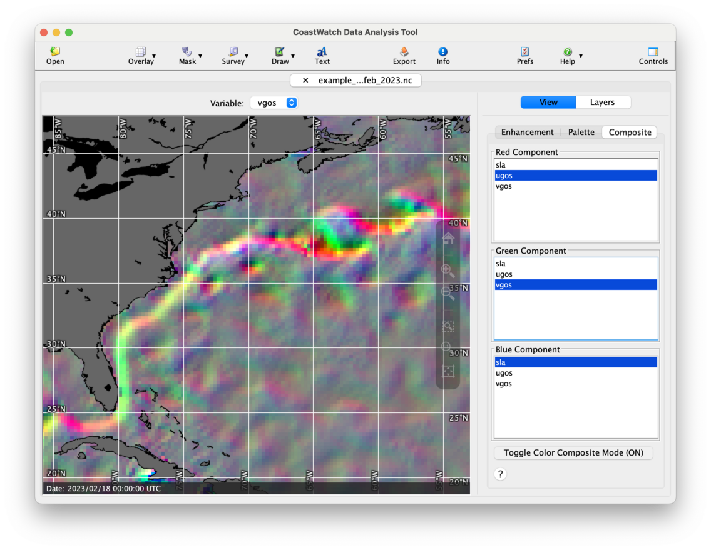

# Color Composite Mode

Color composite mode is an alternate way of deriving the color values at each pixel — it combines data from three different variables to form the pixel colors. Read through the command line exercises on [Color Composite Images](../Unit-3-Command-Line-Tools-for-Extracting-File-Information/Color-Composite-Images.md) for background and examples on how this is done.

For this exercise we'll use the GK-2B Geostationary Ocean Color Imager II (GOCI-II) sensor data file `example_goci2_reflect_jan_2023.hdf`, and create a composite image as follows:

  1. Open the data file and load the **RhoC_620**, **RhoC_555**, and **RhoC_443** variables.
  2. Select the **View | Enhancement** control tab.
  3. For each variable: 
     - Select it using the variable selector above the data view.
     - Change the **Enhancement Range** to [0..1].
     - Change the **Enhancement Function** to **Gamma**.
  4. Select the **View | Composite** control tab.
  5. Set a different variable for each color component: 
     - **Red component** — RhoC_620
     - **Green component** — RhoC_555
     - **Blue component** — RhoC_443
  6. Click the **Toggle Color Composite Mode** button.

You should see an image similar to the following:

The following is an example of a similar process used on the OLCI radiance data file, though the data ranges are different because the data values are in radiance units rather than reflectance. Try to find the ranges by experimentation. The general rule for creating color composites is to enhance each variable with the **BW-Linear** palette so that the lowest values appear black and the highest values appear white, then turn on composite mode. It often helps to use the **Gamma** enhancement function for visible reflectance and radiance data, and a **Linear** function for thermal and other data. 

You can also invent your own creative composites using other physical quantities, for example sea level anomaly and ocean currents data:

###    Bonus exercises:

  - Read these articles on satellite sensor band combinations:
    - [Sentinel 2 Bands and Combinations](https://gisgeography.com/sentinel-2-bands-combinations/)
    - [Why is that Forest Red and that Cloud Blue? How to Interpret a False-Color Satellite Image ](https://earthobservatory.nasa.gov/features/FalseColor)
  - Click the **Help** or **?** button at the bottom of the color composite tab and read the CDAT in-application help on composites.
  - Read the user's guide Section 3.8 on color composite mode.
  - Watch a [YouTube video](https://youtu.be/p26vfa3CJ3Y) for a demonstration of color composite mode on AVHRR data.

---

[« Previous](Drawing-Annotations.md) · [Next »](Unit-4-Assignment.md)
