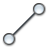
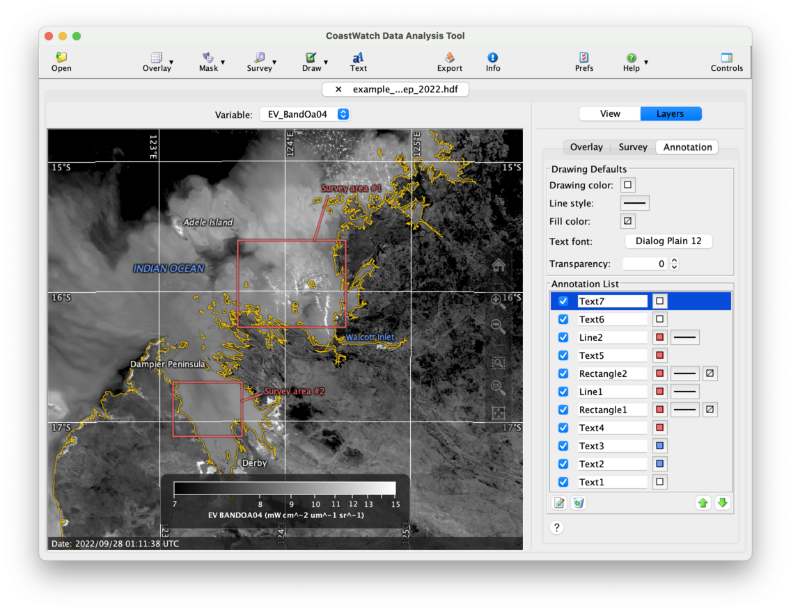

# Drawing Annotations

You can use annotations to draw lines, boxes, circles, curves, and text on the data view, which are included when you export to an image file. Annotations are managed as a list of items, just like data overlays and surveys. 

We'll continue on from the previous exercise on surveys, and draw onto the data view of OLCI radiance data:

  1. Click the    **Draw** button in the toolbar.
  2. Click one of the annotation types and add it to the data view. Some of the more common annotations:  
     -  **Line** — Click + drag
     -  **Rectangle** — Click + drag
     -  **Polygon** — Click corners + double click to end
  3. Go back to step 1 and select a different annotation type.

Also try adding text by clicking the    **Text** button in the toobar and then a location on the data view. For each annotation you add, a new item appears in the **Annotation List**. Similar to data overlays and surveys, you can rearrange, turn on/off, edit the properties, and delete annotations. The following is an example of adding several annotations to the OLCI scene and editing their properties:

###    Bonus exercises:

  - Click the **Help** or **?** button at the bottom of the annotation tab and read the CDAT in-application help on annotations.
  - Read the user's guide Section 3.7 on drawing annotations.
  - Watch a [YouTube video](https://youtu.be/c5De7NZrGn8) for a demonstration of annotations of a typhoon in the western Pacific.

---

[« Previous](Surveying-Data-Variables.md) · [Next »](Color-Composite-Mode.md)
