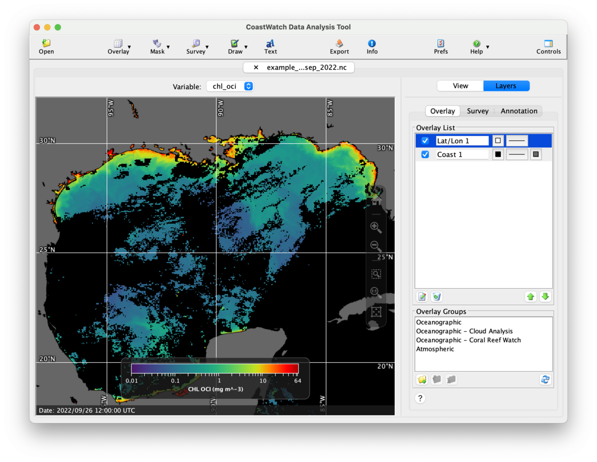
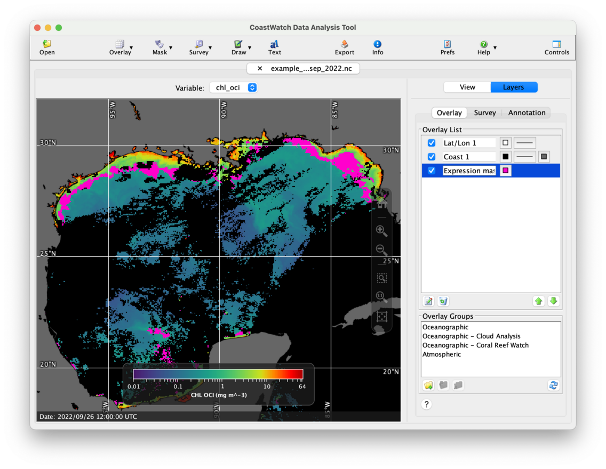

# Expression Mask Overlays

An expression mask is a single color mask that uses a boolean expression — the expression is evaluated using any combination of data variables, and any pixels for which the expression is true are masked.

We'll work through an example of expression masking using the VIIRS chlorophyll data file `example_viirs_chlor_sep_2022.nc`. Before opening the file, customize the preferences for the **chl_oci** variable as follows:

  1. Click the    **Prefs** button in the toolbar. The preferences window appears.
  2. Click    **Enhancement** at the top navigation bar of the preferences.
  3. Type **chl_oci** into the text field at the bottom of the **Variable** list and click the    **Add** button.
  4. Scroll to the bottom of the **Palette** list and select the **NCCOS-chla** palette.
  5. Change the **Minimum** text field to 0.01 and the **Maximum** text field to 64.
  6. Change the **Function** to **Log10**.
  7. Click **OK** to accept the changes.

Now, open the VIIRS chlorophyll data file, select the **chl_oci** variable, and zoom in on the Gulf of Mexico. After adding some coasts and lat/lon lines, you should see a CDAT window similar to the following:

  1. Click the    **Mask** button in the toolbar, and then    **Expression mask**.
  2. An overlay properties window will appear — select bright pink  as the drawing color, and type **chl_oci > 0.5 && chl_oci < 1.5** in the **Mask expression** text field, then click **OK**.
  3. Move the new expression mask overlay to the bottom of the list using the    **Move Down** button.

You should now see the following screen that highlights all chlorophyll values in the range 1.0 ± 0.5 mg/m3:

###    Bonus exercises:

  - Try editing the mask expression to see what else you can highlight.
  - Read the user's guide Section 3.11 on user preferences for more on setting the defaults for palette, range, and units.
  - Read the user's guide appendix on the **cwmath** command, and look at **Legacy Parser Syntax** — this is the syntax used in CDAT mask expressions. For example the expression above could also be written using the abs() absolute value function: **abs (chl_oci - 1) < 0.5** (this is a more obscure formula that accomplishes the same thing).
  - Try opening the ASCAT wind data file and highlighting all **windspeed** data whose **direction** is from the west (ie: > 180).
  - Recreate the bitmask overlay from the [Bitmask Overlays](Bitmask-Overlays.md) page but using expression masking instead.
  - Watch a [YouTube video](https://youtu.be/0p-38fioJFk) on data overlays including expression mask overlays in CDAT.
  - Try using **chl_oci*0 != 0** as the mask expression — this is a way of highlighting the invalid data in a custom color.

---

[« Previous](Multilayer-Mask-Overlays.md) · [Next »](Topographic-and-Bathymetric-Contours.md)
