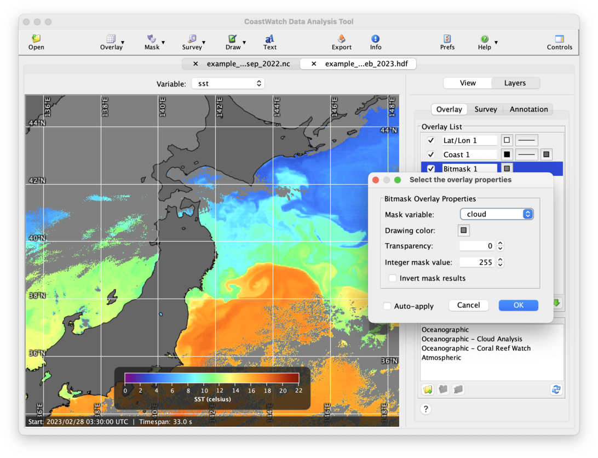
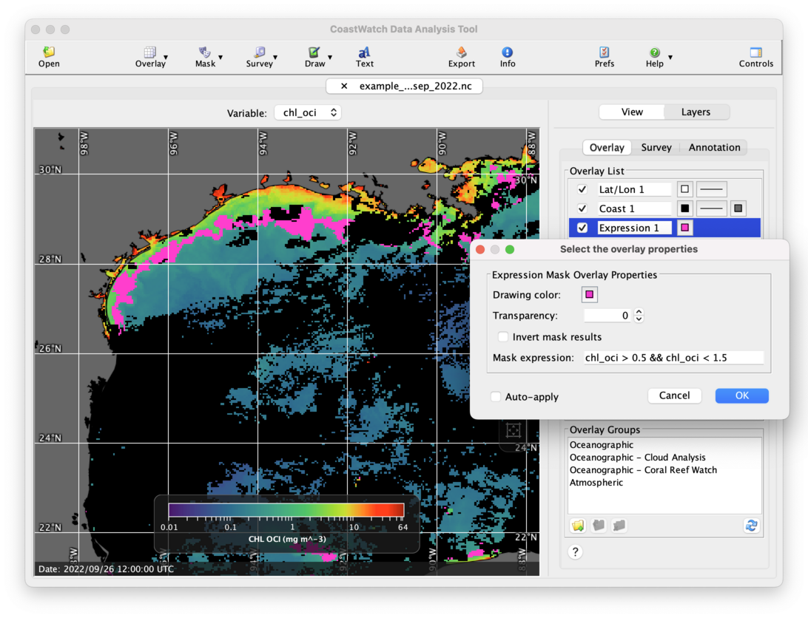

# Mask Overlays

CDAT uses **mask overlays** to highlight or block out pixels from the data view that satisfy certain conditions. For example, you can use a mask overlay to block out cloud pixels with gray (a bitmask overlay), or highlight certain chlorophyll pixels with pink (an expression mask overlay):

### Quality Variables

In some cases mask overlays use data from a separate **quality variable**, provided in the same data file to supply quality information about a scientific data variable. For example, in the `example_avhrr_swath_sst_sep_2022.nc` data file we saw in [Unit 2 - Basics of the CoastWatch Data Analysis Tool](../Unit-2-Basics-of-the-CoastWatch-Data-Analysis-Tool/README.md), the **quality_level** variable holds quality information about the **sea_surface_temperature** variable. There are several techniques used to store quality information as integer data:

  - **Single bits** within each byte are set to 1 if a condition is true, or 0 if a condition is false. For example, a cloud mask variable could have bit 5 set to 1 if a test detects cloud using a thermal uniformity test, or 0 for clear ocean.
  - **Sets of bits** within the bytes encode certain conditions, for example 00 = clear, 01 = probably clear, 10 = cloudy, 11 = undefined. 
  - **Integer value ranges** encode quality levels, for example 0 (low quality) up to 5 (high quality).

The specifics on how quality information is stored are given by metadata attributes attached to the quality variable, for example the **comment** attribute for the **l2p_flags** variable in the AVHRR SST data file has this value:

`l2p_flags:comment = "L2P common flags in bits 1-6 and data provider flags (from ACSPO mask) in bits 9-16: bit01 (0=IR: 1=microwave); bit02 (0=ocean; 1=land); bit03 (0=no ice; 1=ice); bits04-08 (reserved,set to 0); bit09 (0=radiance valid; 1=invalid); bit10 (0=night; 1=day); bit11 (0=ocean; 1=land); bit12 (0=good quality data; 1=degraded quality data due to \"twilight\" region); bit13 (0=no glint; 1=glint); bit14 (0=no snow/ice; 1=snow/ice); bits15-16 (00=clear; 01=probably clear; 10=cloudy; 11=clear-sky mask undefined)"`

We'll show examples of different quality variables and how to use them for masking scientific data in the next several sections. Note that _not all scientific data variables need quality masking_ — some already have quality masks applied and any low quality data values are already marked as invalid. CDAT shows these data values as black (see the example chlorophyll screenshot above). Also not all masks are for quality, in some cases masks can be used for other properties like view or sun angle thresholds, presence of ice, land, type of sensor, day or night, etc.

### Binary Numbers and Operations

In working with data masking, you'll benefit from a knowledge of:

  1. Integer storage in binary, and how each bit contributes to the integer value
  2. Bitwise AND operations

We recommend the Wikipedia articles on [Binary numbers](https://en.wikipedia.org/wiki/Binary_number#Counting_in_binary) and [Bitwise operations](https://en.wikipedia.org/wiki/Bitwise_operation) for explanations of these topics. For reference, Table 4-1 shows the bits in a 16-bit integer and their binary values .

**Table 4-1:** 16-bit integer binary representation

| Bit&nbsp;# | 2n  | Binary&nbsp;value         | Decimal | Bit&nbsp;# | 2n  | Binary&nbsp;value           | Decimal |
|:-----|:----|:----------------------|:--------------|:------|:----|:----------------------|:--------------|
| 1 | 20  | 0000&nbsp;0000&nbsp;0000&nbsp;0001 | 1 | 9  | 28  | 0000&nbsp;0001&nbsp;0000&nbsp;0000 | 256 |
| 2 | 21  | 0000&nbsp;0000&nbsp;0000&nbsp;0010 | 2 | 10 | 29  | 0000&nbsp;0010&nbsp;0000&nbsp;0000 | 512 |
| 3 | 22  | 0000&nbsp;0000&nbsp;0000&nbsp;0100 | 4 | 11 | 210 | 0000&nbsp;0100&nbsp;0000&nbsp;0000 | 1024 |
| 4 | 23  | 0000&nbsp;0000&nbsp;0000&nbsp;1000 | 8 | 12 | 211 | 0000&nbsp;1000&nbsp;0000&nbsp;0000 | 2048 |
| 5 | 24  | 0000&nbsp;0000&nbsp;0001&nbsp;0000 | 16 | 13 | 212 | 0001&nbsp;0000&nbsp;0000&nbsp;0000 | 4096 |
| 6 | 25  | 0000&nbsp;0000&nbsp;0010&nbsp;0000 | 32 | 14 | 213 | 0010&nbsp;0000&nbsp;0000&nbsp;0000 | 8192 |
| 7 | 26  | 0000&nbsp;0000&nbsp;0100&nbsp;0000 | 64 | 15 | 214 | 0100&nbsp;0000&nbsp;0000&nbsp;0000 | 16384 |
| 8 | 27  | 0000&nbsp;0000&nbsp;1000&nbsp;0000 | 128 | 16 | 215 | 1000&nbsp;0000&nbsp;0000&nbsp;0000 | 32768 |

We need to convert numbers between binary and decimal because quality variables and mask overlays use bit numbers and decimal values to indicate to data users how to select specific bits in the quality variable for certain quality conditions. As an example, take the 8-bit binary value 0100 0111. The convention is that bit 1 is the least significant bit (at the right side) and bit 8 is the most significant (at the left side). Converting this binary value to decimal means adding up the values for bits 1, 2, 3, and 7, or 1 + 2 + 4 + 64 = 71. 

To use this number in a mask overlay, CDAT performs a bitwise AND operation to select specific bits in the values of a quality variable, and determine if a pixel should be masked. For example:

  - Mask value used for all data pixels, Vmask = 71 (0100 0111)
  - Quality variable value at a given pixel, Vqual = 2 (0000 0010)
  - Result of bitwise AND operation = Rpixel = [Vmask & Vqual] = 2 (0000 0010)
  - If result Rpixel ≠ 0 then mask pixel

In this way, a mask overlay allows data users to visually show the conditions stored in one or more bits in a quality variable. If the mask value 71 is applied to the **l2p_flags** variable as shown above, it would select out and highlight all pixels with bits 1, 2, 3, and 7 set — ie: microwave, land, or ice pixels. The next few sections show the how different types of mask overlays use these binary operations.

---

[« Previous](README.md) · [Next »](Bitmask-Overlays.md)
