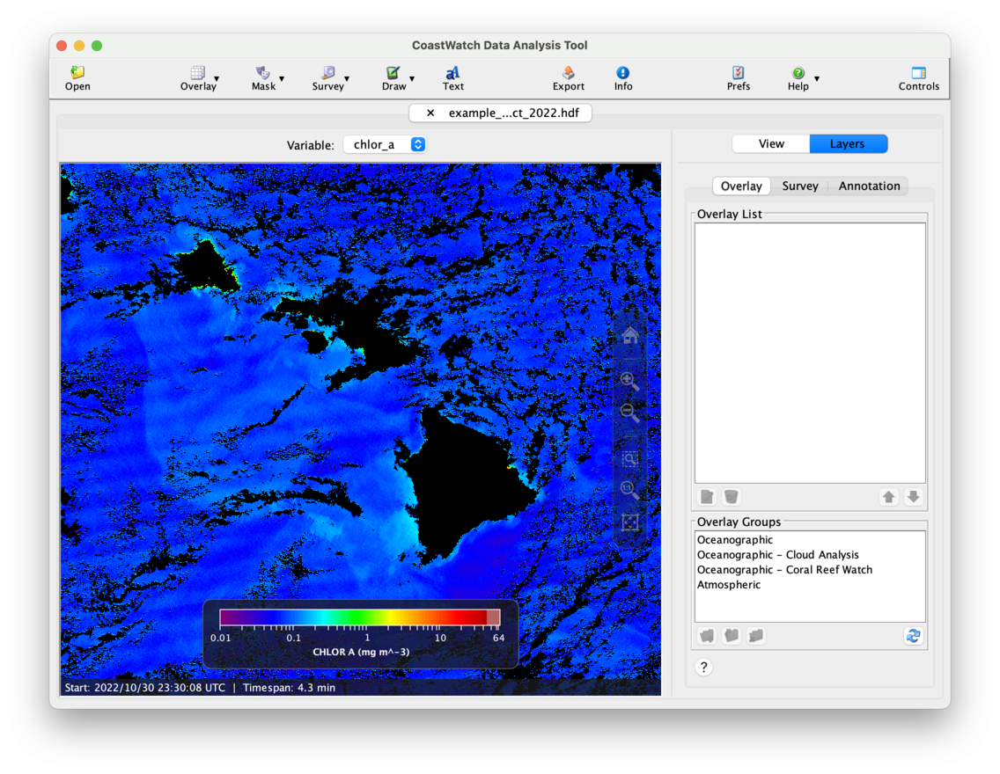
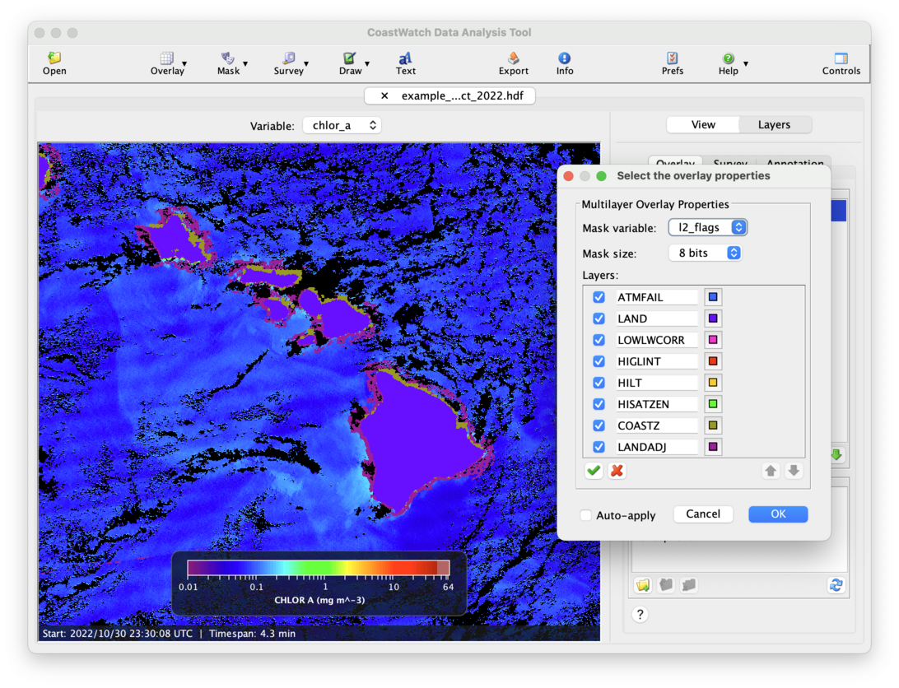

# Multilayer Mask Overlays

A multilayer mask overlay combines a set of single-color bitmask overlays. A multilayer mask uses data values from a quality variable to color each pixel whose bit is set to 1 with a different color. 

We'll start by opening the VIIRS chlorophyll data file `example_viirs_chlor_flags_oct_2022.hdf` in CDAT and loading the **chlor_a** and **l2_flags** variables, then zoom into Hawaii:

The **l2_flags** variable holds quality information that we'll use to mask the chlorophyll data, using individual bits in a 32-bit integer. For simplicity we'll show an example using the first 8 bits as follows:

  1. Click the    **Mask** button in the toolbar, and then    **Multilayer bitmask**. 
  2. An overlay properties window will appear — select **l2_flags** as the mask variable, leave the mask size as 8-bits, and then replace the layer labels as follows:
     - Bit 1 → ATMFAIL
     - Bit 2 → LAND
     - Bit 3 → LOWLWCORR
     - Bit 4 → HIGLINT
     - Bit 5 → HILT
     - Bit 6 → HISATZEN
     - Bit 7 → COASTZ
     - Bit 8 → LANDADJ
  3. Click **OK** to finish creating the overlay.
  4. Select the new **Multilayer 1** overlay in the list and click the    **Edit** button.

You should now see the following:

We can now turn on and off each bitmask layer to see which pixels it masks. Make sure the **Auto-apply** is checked to see each change to the overlay as you make it. The main bitmask layers that you'll see in this view will be the LAND, COASTZ, and LANDADJ bits. Zoom out while keeping the overlay properties window open to see the HISATZEN and LOWLWCORR bits.

###    Bonus exercises:

  - Click the    **Info** button in the toolbar to look at the raw metadata for the **l2_flags** variable and see what the various flag bits contain. This metadata shows only the **flag_masks** and **flag_meanings** attributes, and not the corresponding bit numbers. You can use the [Wang et al., VIIRS Ocean Color ATBD, Version 1.0, June 2017](https://www.star.nesdis.noaa.gov/socd/mecb/color/documents/ATBD_VIIRS_OC_v1.0_June2017_f2.pdf) as the documentation for all the flag bits (see the table on page 39, and note the bit numbering start at 0).
  - Try changing the mask size to 32-bits to see all the flags. Turn on bit 21 to see the moderate sunglint contamination mask.
  - Try clicking the    **Show All** and    **Hide All** buttons and see what they do.
  - See the [Saving and Loading Overlay Groups](Saving-and-Loading-Overlay-Groups.md) exercises — there you'll find a bonus exercise for loading a pre-made overlay group with labels for all 32 bits of the **l2_flags** variable.

---

[« Previous](Bitmask-Overlays.md) · [Next »](Expression-Mask-Overlays.md)
