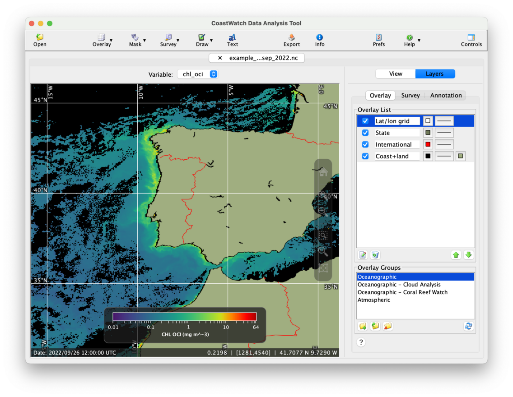
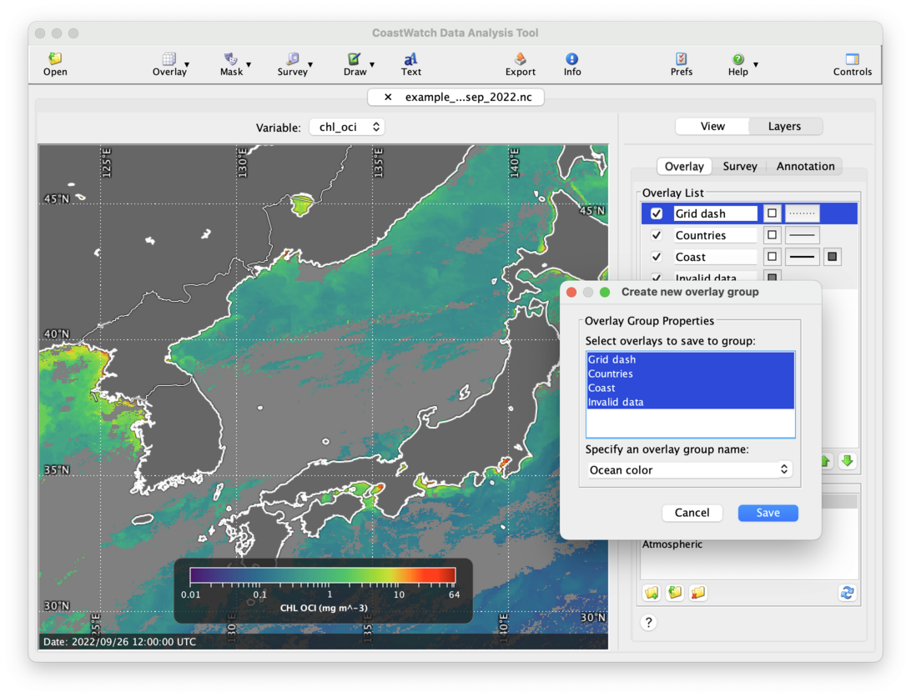

# Saving and Loading Overlay Groups

In CDAT, the **Overlay Groups** area in the **Layers | Overlay** control tab lets you save and load a set of overlays that you frequently use. Overlay groups are useful for when you’ve created a complex set of overlays, arranged them in the correct order, changed their properties, and want to save and re-use them.

As an example of loading an overlay group, open any of the example data files that you're familiar with (the examples below show chlorophyll concentration from the `example_viirs_chlor_sep_2022.nc` data file), then:

  1. Select the **Layers | Overlay** control tab.
  2. In the **Overlay Groups** list select the **Oceanographic** group.
  3. Click the    **Load** button at the bottom of the list (or you can also double-click **Oceanographic**).
  4. A set of overlays is added to the **Overlay List**.

Your data view will have overlays that look like the following:

To create and save your own custom overlay group:

  1. **Optional**: Start fresh by removing any existing overlays using the    **Remove** button.
  2. Create, edit, and rearrange your own set of overlays. 
  3. Click the    **Create** button in the **Overlay List** — a **Create new overlay group** window will appear.
  4. Select the overlays for your new group (Ctrl-click or ⌘-click to select multiple items).
  5. Enter your new group name in the text field or select an existing overlay group in the list to replace it.
  6. Click **Save**. 

The following is an example of a custom set of overlays being saved:

Now you can load your custom group by selecting it in the **Overlay Groups** list and clicking the    **Load** button. The new overlays are inserted into the **Overlay List** before any existing items — it often makes sense to clear out any overlays before opening a new group.

   <ins>NOTE</ins>: You cannot save a shape overlay to a group because it references an external data file.

###    Bonus exercises:

  - Read the user's guide Section 3.5.3 on overlay groups.
  - Click the **Help** or **?** button at the bottom of the overlay layers tab and read the CDAT in-application help on overlays and overlay groups.
  - Try opening the **Atmospheric** overlay group.
  - Read the user's guide Section 3.11 on user preferences to see where overlay groups are stored (or select **Open User Resources Directory** from the **Tools | Preferences** menu). Try installing the `NOAAOceanColorMasks.jso` file from the [cw_utils_sample_data.zip](../downloads/cw_utils_sample_data.zip) file into your `<RESOURCES>/overlays/` directory for use with the [Multilayer Mask Overlays](Multilayer-Mask-Overlays.md) exercises.

---

[« Previous](Shape-Overlays.md) · [Next »](Surveying-Data-Variables.md)
