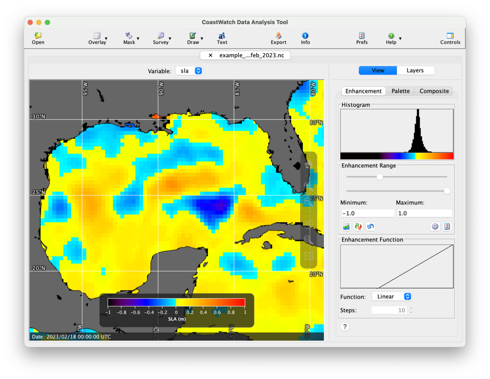
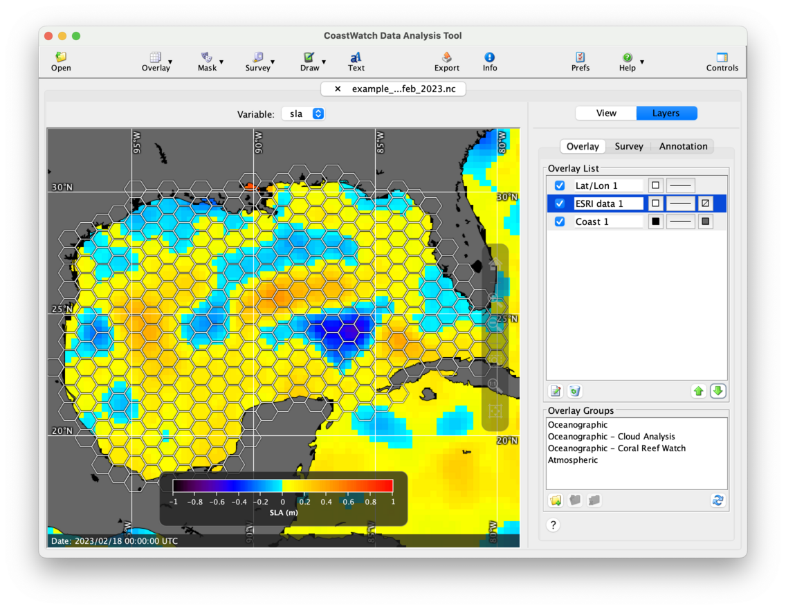

# Shape Overlays

A shape overlay displays line and polygon data stored in ESRI shapefile format with a geographic WGS 84 projection. Shapefile data is freely available from many [GIS data websites](https://gisgeography.com/best-free-gis-data-sources-raster-vector/). For this exercise we'll use the `example_altim_surface_curr_feb_2023.nc` data file and overlay the `Hexagon_50km_length.shp` shapefile, a hexagonal grid [created for the Gulf of Mexico](https://hub.arcgis.com/maps/7987ca0d7fe64da69cddfdac77ad6133/about).

Start by opening the data file and loading the **sla** variable. Change the palette to **CRW_SSTANOMALY** and the range from -1.0 to 1.0. Then add coastlines, lat/lon lines, and zoom in to the Gulf of Mexico. The data view should look similar to the following:

To add the hexagonal grid shape overlay:

  1. Click the    **Overlay** button in the toolbar, then    **Shape files** — a file chooser window will appear and you can manually navigate to the shapefile, or drag it into the chooser window.
  2. Select the new **ESRI data 1** overlay and edit the properties to draw line drop shadows. This helps highlight the white lines on a light background.
  3. Move the new shape overlay to the middle of the list between the coast and lat/lon overlay using the    **Move Down** button. That way the shape lines render on top of the land polygons.

You should now see a data view similar to the following:

###    Bonus exercises:

  - Try loading your own shapefile data from one of the free online data sources.
  - Edit the properties of the shape overlay, and add a **Fill color** and a **Transparency** value.

---

[« Previous](Topographic-and-Bathymetric-Contours.md) · [Next »](Saving-and-Loading-Overlay-Groups.md)
