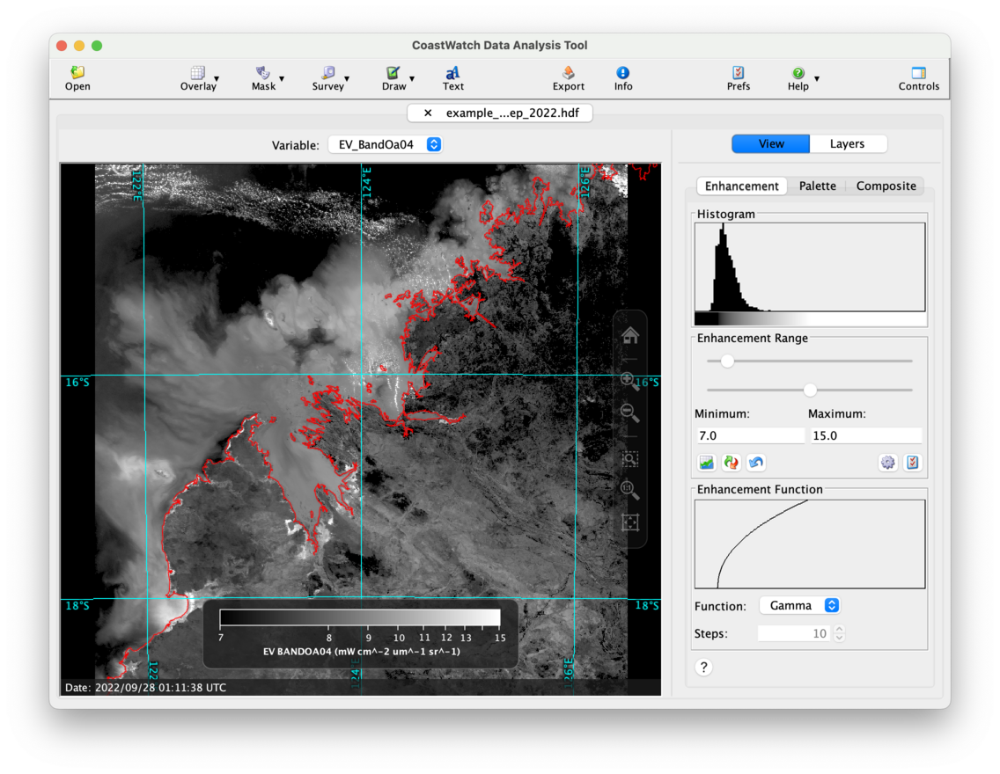
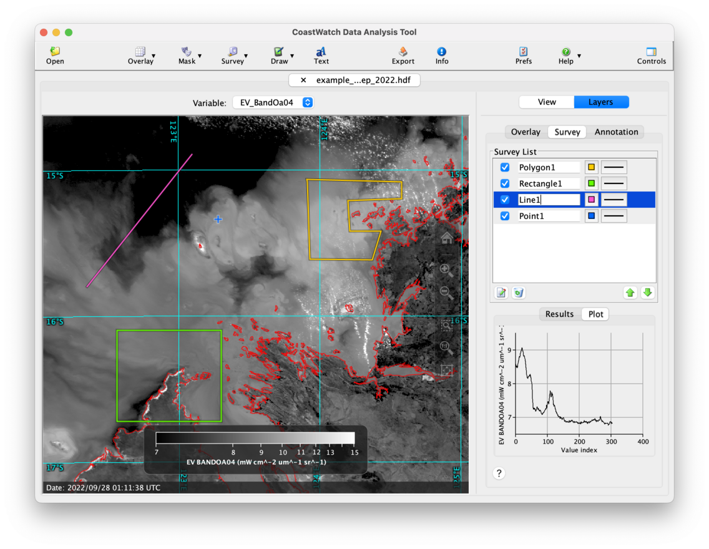

# Surveying Data Variables

Data surveys allow you to measure distances and get statistics of the variable in the data view. You can select points, lines, and areas — each survey results in a set of data statistics, survey dimensions such as endpoints and distances, and a line plot or histogram plot.

For this exercise, we'll use the Ocean and Land Color Instrument (OLCI) radiance data from Sentinel-3 in the `example_olci_rad_sep_2022.hdf` data file. Load the data file into CDAT and choose one of the bands to use and enhance the contrast appropriately. In the following screen capture we've used band 4, enhanced it using a **Gamma** function, and added the **Atmospheric** overlay group:

Now try performing a series of data surveys as follows:

  1. Click the    **Survey** button in the toolbar.
  2. Click one of the survey types and perform it on the data view as follows (instructions will also show up at on the data view):
     -  **Single point** — Single click
     -  **Line** — Click + drag
     -  **Rectangular area** — Click + drag
     -  **Polygon area** — Click corners + double click to end
  3. Go back to step 1 and select a different survey type.

For each survey you perform, a new item is added to the **Survey List**, and you can select an item in the list to see the survey **Results** and **Plot** at the bottom of the tab. Similar to data overlays, you can rearrange, turn on/off, edit the properties, and delete surveys. The following is an example of performing several surveys on OLCI band 4 radiance and changing their colors to make them visually distinct:

###    Bonus exercises:

  - Click the **Help** or **?** button at the bottom of the data surveys tab and read the CDAT in-application help on surveys.
  - Read the user's guide Section 3.6 on performing surveys.
  - Watch a [YouTube video](https://youtu.be/P8ePmAV-aYg) for a demonstration of surveys on an AVHRR data file.

---

[« Previous](Saving-and-Loading-Overlay-Groups.md) · [Next »](Drawing-Annotations.md)
