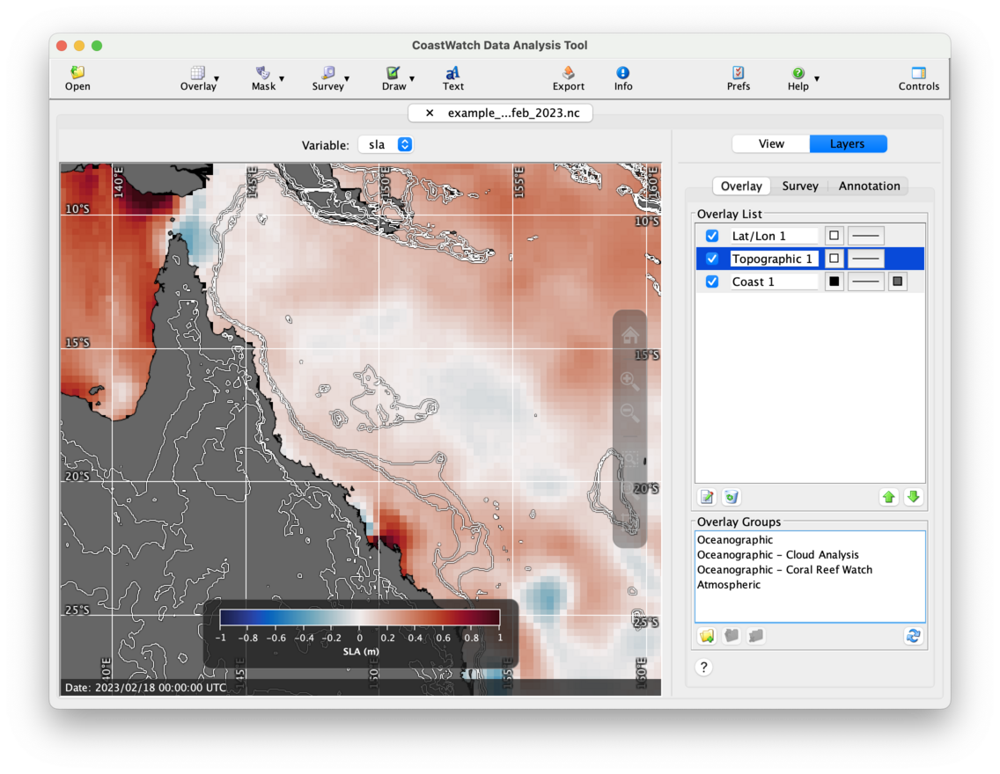

# Topographic and Bathymetric Contours

You can add topographic and bathymetric contour lines to the data view using a topography overlay. Contours are computed on-the-fly from a built-in data file containing [ETOPO 5-minute resolution](https://www.ncei.noaa.gov/products/etopo-global-relief-model) elevation data. In this exercise we'll use the ocean currents data file `example_altim_surface_curr_feb_2023.nc` and render sea level anomaly with bathymetric contours.

Start by opening the data file and loading the **sla** variable. Change the palette to **Ocean-balance** and the range from -1.0 to 1.0. Then add coastlines, lat/lon lines, and zoom in to northeastern Australia. The data view should look similar to the following:

To add and edit a topography overlay, do the following:

  1. Click the    **Overlay** button in the toolbar, then    **Topographic and bathymetric contours**. By default a topography overlay with 200 m and 2000 m depth contours is created.
  2. Select the new **Topography 1** overlay in the **Overlay List** and click the    **Edit** button — an overlay properties window will appear.
  3. Turn on the **Draw line drop shadow** check box. 
  4. Remove the -200 and -2000 entries in the list by selecting them and using the    **Remove** button.
  5. Add contours for -500, -200, -100, 100, 200, and 500 using the text field under the **Levels** list. You can type each one and hit the **Enter** key or click the    **Add** button.
  6. Click **OK** to accept all the changes.
  7. Move the new topography overlay to the middle of the list between the coast and lat/lon overlay using the    **Move Down** button. That way the topography lines render on top of the land polygons.

You should now see a data view similar to the following:

   <ins>NOTE</ins>: Use caution with rendering topography overlays in a large area such as a global data view. It's best to avoid this because it can take a significant time for CDAT to create and render many contours over such a large area, and can also fail to render properly.

###    Bonus exercises:

  - Try opening another data file and adding a topography overlay for your own area of interest.
  - View topographic elevation data directly by opening the ETOPO data file in your CoastWatch Utilities installation directory `<INSTALLDIR>/data/noaa/coastwatch/render/etopo5.hdf`.
  - As of version 4.0.0 of the CoastWatch Utilities, a 1 km ETOPO data file is also availalble from the CoastWatch Utilities distribution page under the _Data Tools_ section of the [CoastWatch central operations](https://coastwatch.noaa.gov) website.
  - Search online for other sources of topographic contour data that you can use in the next exercise on shape overlays.

---

[« Previous](Expression-Mask-Overlays.md) · [Next »](Shape-Overlays.md)
