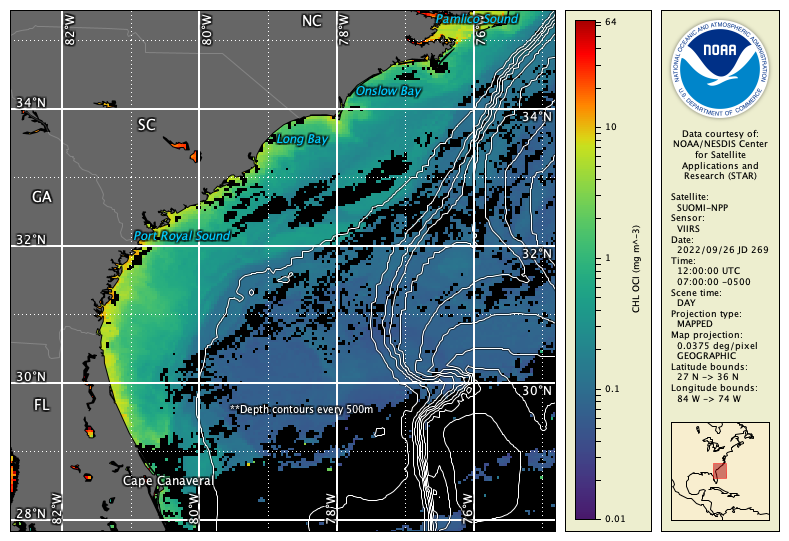
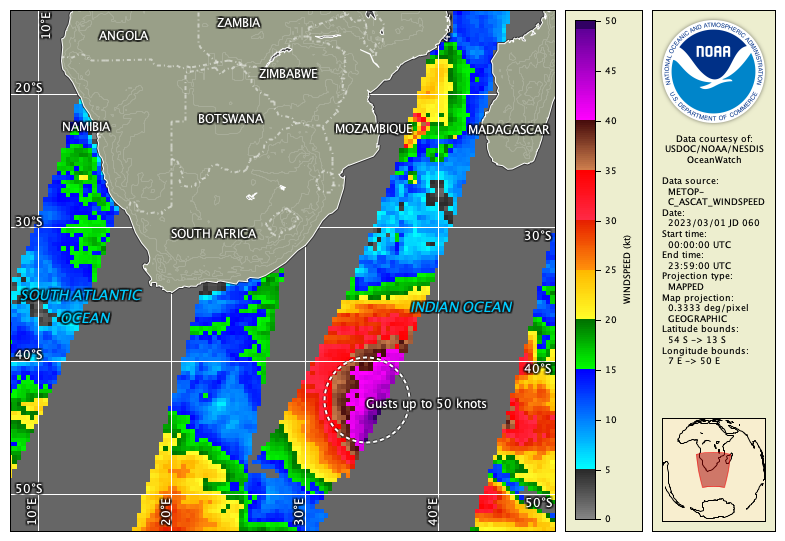

# Unit 4 Assignment

The goal of this assignment is to:

  - Explore a data file in CDAT that is of interest to you.
  - Practice using data overlays, surveys, and annotations.
  - Become more familiar with CDAT features.

Follow these steps:

  1. Select one of the example data files, open the file in CDAT, and load the variables that are of interest to you. You may need to adjust the default palette and range for your variables in the preferences and re-load.
  2. For one of the variables in your file, find out everything that you can about how it was created by looking at the raw metadata. For example: algorithm used, group responsible for processing, contact email for questions, data processing history, etc. Some data variables may not have all this information, depending on the data provider.
  3. Zoom in on an area of particular interest. Perform a box survey and look at the resulting statistics to help determine a suitable data range for your zoomed-in geographic area.
  4. Create and save an overlay group with overlays that work well for your data variable. Use at least four of the following: Grid, Coast, Political, Topography, Mask, and Shape. Edit all the following properties somewhere among your overlays: line color, fill colour, line style, font, drop shadow, and transparency.
  5. Use annotations to label several features in your data view, either data features or geographic features.
  6. Export your data view to an image format of your choice: PNG, JPEG, PDF.

The following are some sample images to give you ideas:

Assignment hints:

  - Look for **File Information** and **Preferences** in the **Tools** menu to complete parts of this assignment.
  - Use a web search and Google Maps to help you with geographic labels.
  - Some of the attributes about how the data was processed may be in the global metadata.
  - Look for help in the user's guide, YouTube videos, and in the examples and information throughout Unit 4.

---

[« Previous](Color-Composite-Mode.md) · [Next »](Unit-4-Quiz.md)

