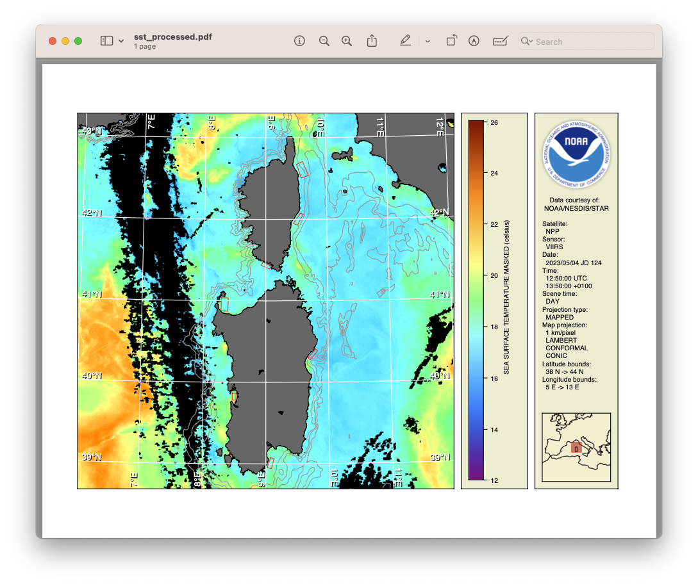

# Automated Data Processing

Data files obtained from a data provider such as CoastWatch need one of more tools run on them to produce results useful to you. To automate that task, it's common to use a script. All the tools presented in this unit and [Unit 3 - Command Line Tools for Extracting File Information](../Unit-3-Command-Line-Tools-for-Extracting-File-Information/README.md) can be run from a Unix script or Windows batch file:

  - **cwcomposite** - Combines a time series of earth data
  - **cwcoverage** - Creates a geographic coverage map for earth data sets and ground stations
  - **cwexport** - Translates earth data into external formats
  - **cwimport** - Translates earth data into CoastWatch HDF format
  - **cwinfo** - Dumps earth data information in a display-friendly format
  - **cwmaster** - Creates map projection master datasets interactively
  - **cwmath** - Combines earth data using a mathematical expression
  - **cwregister2** - Resamples earth data using high accuracy algorithms (replaces cwregister)
  - **cwrender** - Performs earth data visualization
  - **cwsample** - Extracts data values at specified earth locations
  - **cwscript** - Runs a script written in BeanShell (beanshell.org)
  - **cwstats** - Calculates statistics for variables in an earth data file
  - **hdatt** - Reads or writes HDF file attributes

As a possible real-world scenario, suppose that a fictitious aquaculture company wants to supplement their ocean enclosure monitoring with satellite observations. They need a daily custom sea surface temperature (SST) image with:

  - Enclosure locations marked to identify any oceanographic features that may adversely affect their stock
  - Geographic information for reference such as lat/lon graticule lines, depth contours, and coastlines
  - Temperatures in their preferred units (Celsius or Fahrenheit)
  - A file format that can easily be emailed to the on-site managers

Suppose that a script to perform these steps starts with level 2 SST data files, and outputs a PDF file for the managers. The script would use the command line tools as follows:

  1. Register the data files to a common master projection template (**cwregister2**)
  2. Mask out any low quality data values (**cwmath**)
  3. Composite the data to create a large area mosaic (**cwcomposite**)
  4. Render the data to a PDF file (**cwrender**)

The following script is an example of these steps, written in Unix shell (a Windows batch file is also provided in the sample data ZIP file):
    
    #!/bin/sh  

    ###  
    # These parameters can be customized for the script.  
    #  
    master=Aquaculture_region.hdf  
    shapes=Aquaculture_polygons.shp  
    output=sst_processed.pdf  
    var=sea_surface_temperature  
    quality=quality_level  
    units=celsius  
    range=12/26  
    palette=HSL256  
    depths=200/500/1000  

    ###  
    # Start the data processing  
    #  
    inputs="$@"  
    rm -f reg_*.hdf  
    n=1  
    for input in $inputs ; do  
      echo "Working on input file $n"  
      echo ".. Registering"  
      cwregister2 --master $master --match "($var|$quality)" $input reg_$n.hdf  
      echo ".. Masking"  
      cwmath --template $var --expr "${var}_masked = $quality < 5 ? NaN : $var" reg_$n.hdf  
      n=`expr $n + 1`  
    done  

    echo "Compositing data files"  
    rm -f composite.hdf  
    cwcomposite --method latest --match ${var}_masked reg_*.hdf composite.hdf  

    echo "Creating output $output"  
    rm -f $output  
    cwrender --coast black/gray40 --grid white --shape $shapes/red \  
      --bath gray60/$depths --enhance ${var}_masked --palette $palette \  
      --units $units --range $range composite.hdf $output

You can run the script as follows using the example SST data file from the Visible Infrared Imaging Radiometer Suite (VIIRS) sensor:

`./sst_process.sh example_viirs_swath_sst_apr_2023.nc`

This example runs using a single input data file but the script is written to accept multiple files. Your script should run and produce a PDF file that looks like the following (the small red boxes mark the enclosures):

###    Bonus exercises:

  - Customize the SST processing script to produce a different output file format with your own preferred set of geographic overlays. The **cwrender** manual page will be useful.
  - Use **cwmaster** to create your own master projection template and use that in the script instead of the one provided.
  - Use your own ESRI shapefile data for the aquaculture enclosure polygons. You could create a custom shapefile visually using the [geojson.io](https://geojson.io) tool.
  - Watch a [YouTube video](https://youtu.be/wAjttnTBRBA) showing the use of a script that composites and renders a year of chlorophyll data.

---

[« Previous](Direct-Software-Library-Access-cwscript.md) · [Next »](Unit-5-Assignment.md)
