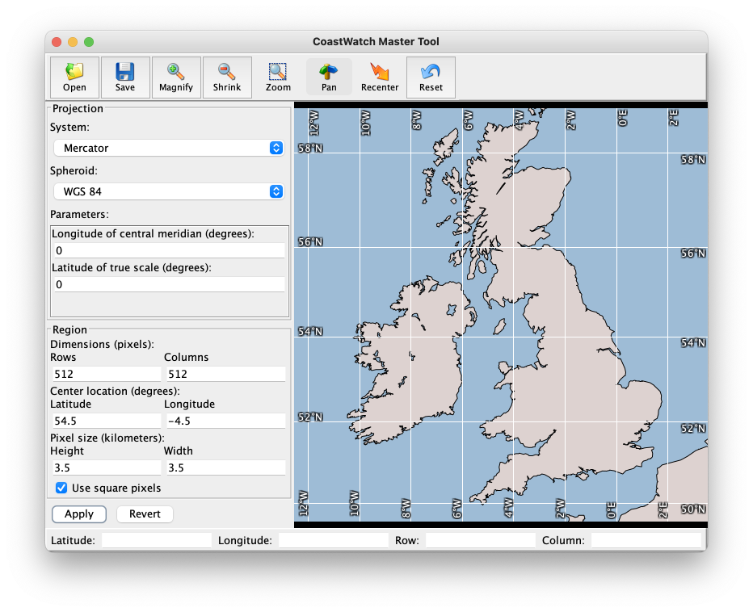
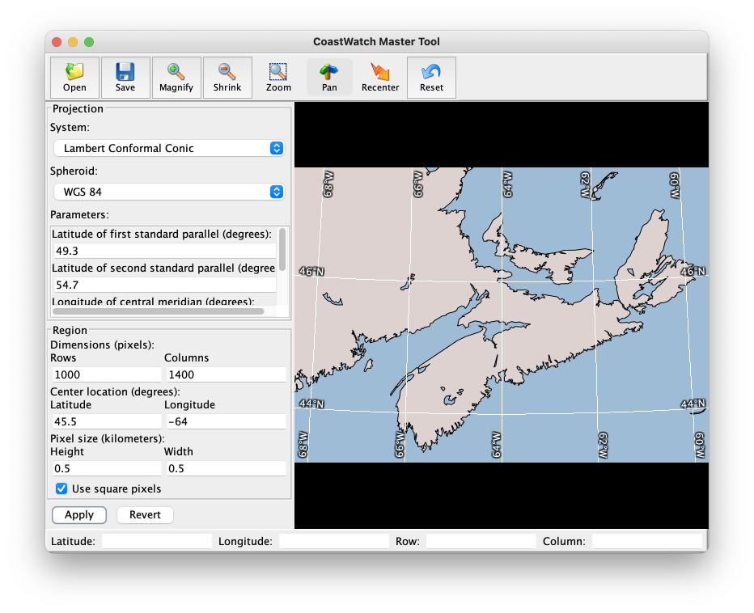
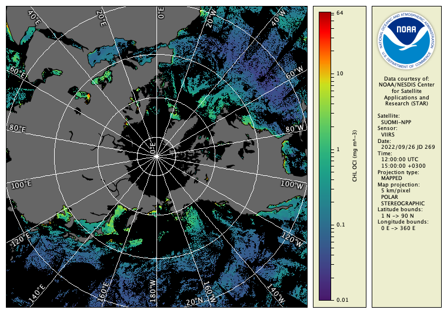

# Creating Map Projections (cwmaster)

The **cwmaster** tool is an interactive tool for designing map projection master templates. The tool enables you to specify map projections supported by the [General Cartographic Transformation Package](https://github.com/tdanckaert/GCTP) (GCTP), such as Mercator, polar stereographic, orthographic, and many others. Once a master template is created you can used it in the **cwregister2** tool to resample data to the new projection (see the previous section for exercises on how to do this).

To start **cwmaster**, depending on your operating system:

  - Windows: Find it in your Windows Start Menu as the **CoastWatch Master Tool**.
  - Linux: Find it in the bin/ directory of your software installation, or type 'cwmaster' from a command prompt.
  - Mac: Find it in the bin/ directory of your software installation as the **CoastWatch Master Tool**, inside your Applications folder.

Once started, **cwmaster** shows a default Mercator projection centred near the Gulf of Mexico at [30°N, 90°W]:

These are the main elements of the interface:

  - **Tool bar** — Open and save master projection templates, change the region parameters interactively, and reset to the original Mercator projection.
  - **Master view** — Shows the current projection and region.
  - **Track bar** — Tracks mouse movement and shows the pointer location in latitude/longitude and image row/column coordinates.
  - **Projection parameters** — Change the map projection system, spheroid, and map projection system-specific parameters.
  - **Region parameters** — Change the region dimensions, center location, and pixel size parameters.

You can change the projection or region parameters and click the **Apply** button to update the master view. For example, make the following changes to the region parameters:

  - Latitude: 54.5
  - Longitude: -4.5
  - Height: 3.5
  - Width: 3.5

Then click the **Apply** button. You should see the following master view:

For a more complex example, make the following changes to both the projection and region parameters:

- Projection parameters 
  - System: Lambert Conformal Conic
  - Spheroid: WGS 84
  - Latitude of first standard parallel: 49.3
  - Latitude of second standard parallel: 54.7
  - Longitude of central meridian: -64
  - Latitude of projection origin: 45.5
- Region parameters 
  - Rows: 1000
  - Columns: 1400
  - Latitude: 45.5
  - Longitude: -64
  - Height: 0.5
  - Width: 0.5

Then click the **Apply** button. You should see the following (this happens to be a projection used on some aviation charts in Canada):

So far, these examples have been specific manual changes to the projection and region parameters — you can also make region changes visually using the tool bar buttons. For example try clicking the    **Pan** button, and then click and drag on the master view to change the region center location.

Rather than having to create the projection master template directly, you can also load one from any level 3 data file, modify it, and save it:

  1. Click the    **Open** button in the tool bar and use the file chooser to select the `example_goci2_reflect_jan_2023.hdf` data file. 
  2. Click **Open** in the file chooser to open the data file.
  3. The master view and projection and region parameters update to show the file's map projection.
  4. Make some changes to the master view or parameters. Remember to click **Apply** if you change parameters manually. 
  5. Click the    **Save** button in the tool bar,
  6. Choose a file name and location and click **Save** in the file chooser.
  7. The file is saved as an empty HDF file that contains only the projection master template parameters and no data variables.

###    Bonus exercises:

  - Click **Help and Support** in the **Help** menu for more on operating **cwmaster**.
  - Try using the **Revert** button — what does it do? Hint: Read through the in-application help system mentioned above.
  - Look in the **Options** menu and turn on the borders.
  - Save a master template file of your own design use it with the `--master` option in the **cwregister2** tool from the previous section, with the `example_viirs_chlor_sep_2022.nc` data file as the input. View your results in CDAT or using **cwrender**. If you're not sure what projection to choose, try to recreate the following image:

---

[« Previous](Registration-to-a-Map-Projection-cwregister2.md) · [Next »](Spatial-and-Temporal-Composites-cwcomposite.md)
