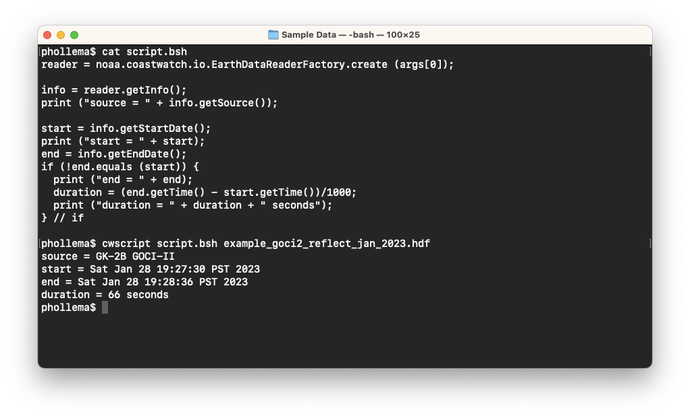
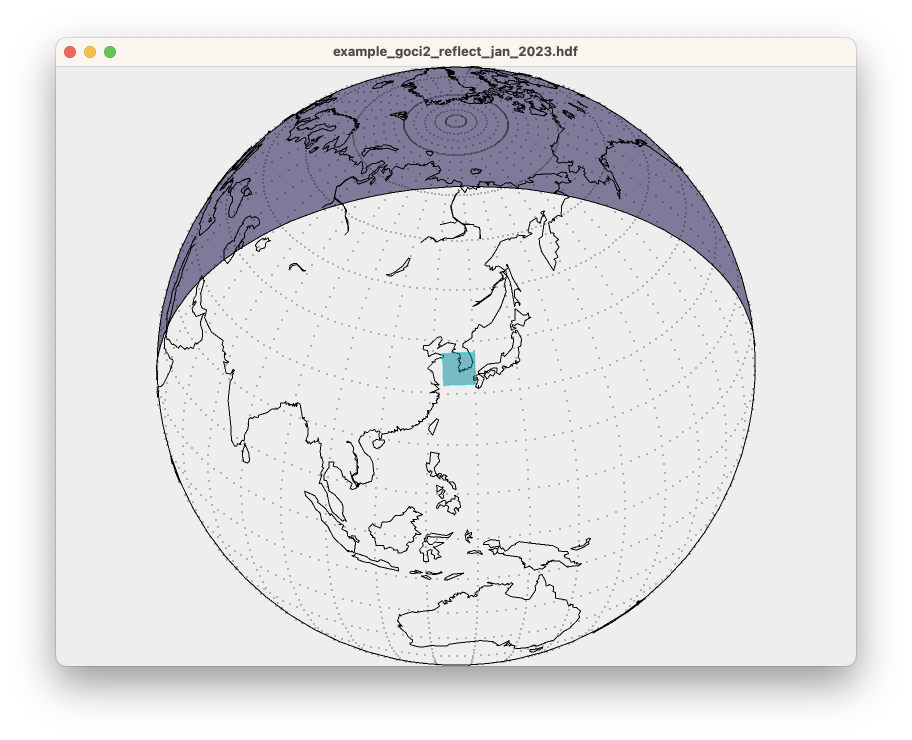

# Direct Software Library Access (cwscript)

The **cwscript** tool gives direct access to the CoastWatch software library via the [BeanShell language](https://github.com/beanshell/beanshell) (similar to JavaScript). All of the CoastWatch API is available from the BeanShell script. See Chapter 4 - Programmer's API in the user's guide for finding the API documentation in your installation, or view the [latest API online](https://terrenus-storage.s3.amazonaws.com/cwutils/doc/api/index.html). This method of data access is useful for those with Java, C++, JavaScript, and Python programming experience. Since BeanShell is an interpreted language, **cwscript** can be used to:

  - Perform rapid prototyping of code that may later be included in the main command line tools
  - Extend the command line tools functionality by users

You can find sample scripts in the **cwscript** manual page. For example, copy and paste the following BeanShell code into a text file named `script.bsh`:
  
    reader = noaa.coastwatch.io.EarthDataReaderFactory.create (args[0]);  
    
    info = reader.getInfo();  
    print ("source = " + info.getSource());  
    
    start = info.getStartDate();  
    print ("start = " + start);  
    end = info.getEndDate();  
    if (!end.equals (start)) {  
      print ("end = " + end);  
      duration = (end.getTime() - start.getTime())/1000;  
      print ("duration = " + duration + " seconds");  
    } // if  

Then run the code on the `example_goci2_reflect_jan_2023.hdf` data file:

Your output may look different depending on your computer's timezone. Running user-developed GUI applications is also possible using the companion **cwgscript** tool — for example copy and paste the following BeanShell code into a text file named `coverage.bsh`:
  
    import java.awt.Color;  
    import java.awt.Dimension;  
    import javax.swing.JFrame;  
    
    import noaa.coastwatch.io.EarthDataReaderFactory;  
    import noaa.coastwatch.render.EarthContextElement;  
    import noaa.coastwatch.util.DataLocation;  
    import noaa.coastwatch.util.EarthLocation;  
    import noaa.coastwatch.util.SolarZenith;  
    import noaa.coastwatch.gui.GUIServices;  
    import noaa.coastwatch.gui.WindowMonitor;  
    import noaa.coastwatch.gui.EarthContextPanel;  
    
    file = args[0];  
    reader = EarthDataReaderFactory.create (file);  
    info = reader.getInfo();  
    trans = info.getTransform();  
    dims = trans.getDimensions();  
    rows = dims[0];  
    cols = dims[1];  
    
    center = trans.transform (new DataLocation (rows/2, cols/2));  
    element = new EarthContextElement (center);  
    element.setGrid (true);  
    element.setEdge (true);  
    element.setGridIncrement (10);  
    element.setSolarZenith (new SolarZenith (info.getDate()));  
    element.setSolarZenithFill (null, new Color (129, 121, 153));  
    min = new DataLocation (0, 0);  
    max = new DataLocation (rows-1, cols-1);  
    element.addBoundingBox (trans, min, max, new Color (0, 210, 236), null);  
    
    panel = new EarthContextPanel (element);  
    panel.setPreferredSize (new Dimension (800, 600));  
    frame = new JFrame (file);  
    frame.setContentPane (panel);  
    frame.addWindowListener (new WindowMonitor());  
    frame.pack();  
    
    GUIServices.showFrame (frame);

Then run the code as follows:

`cwgscript coverage.bsh example_goci2_reflect_jan_2023.hdf`

You should see a new window appear that looks like the following:

This is the GUI equivalent of the **cwcoverage** tool (not explicitly covered in this course) which performs a similar operation and outputs to an image file.

###    Bonus exercises:

  - Find other code examples to run in the **cwscript** manual page.
  - Modify the coverage script code in some way. You can get ideas from the API documentation for the [EarthContextElement](https://terrenus-storage.s3.amazonaws.com/cwutils/doc/api/noaa/coastwatch/render/EarthContextElement.html) class.
  - Write a script that prints out the latitude and longitude of a data file center location.
  - Look at the manual page for the **cwcoverage** tool and try running it on the same GOCI-II data file.

---

[« Previous](Spatial-and-Temporal-Composites-cwcomposite.md) · [Next »](Automated-Data-Processing.md)
