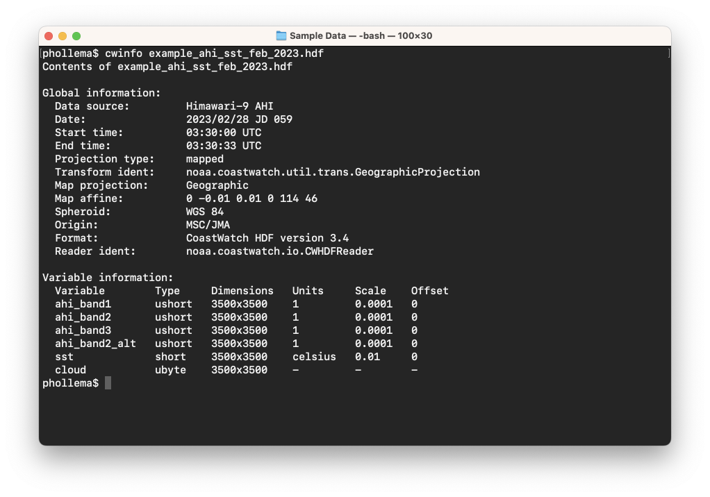
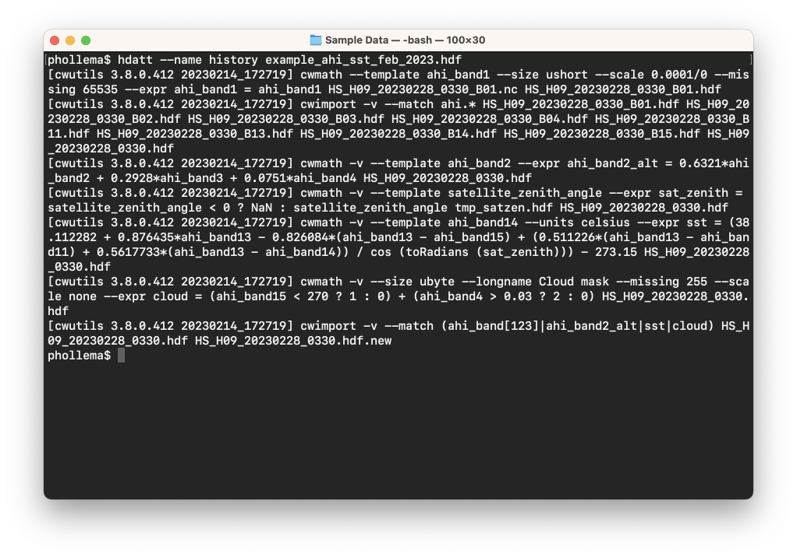
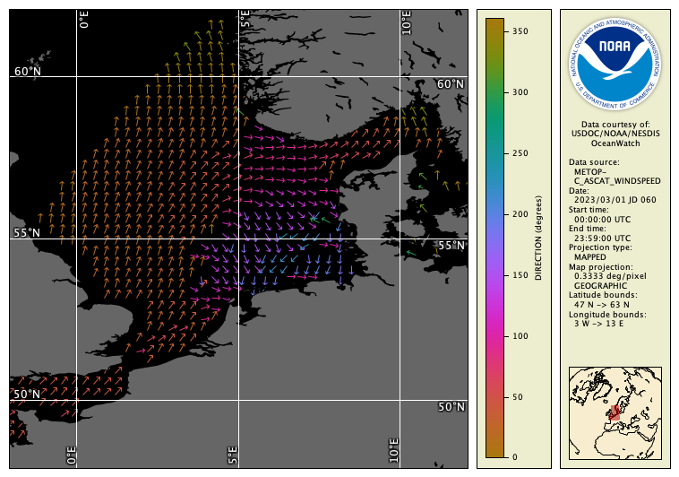
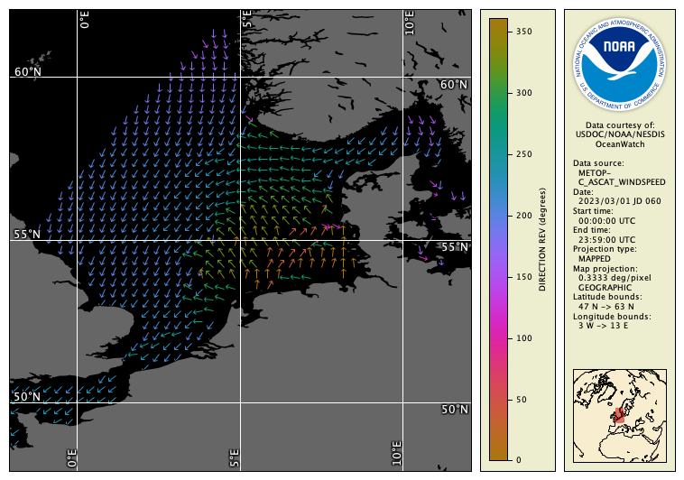

# Generic Variable Math (cwmath)

The **cwmath** program is a command line tool that takes a math expression of the form **y = F(a,b,c,...)** where a,b,c... are data variables in the file, and loops over each pixel in the file to compute the function F. The function is specified in terms of standard operators like add (+), subtract (-), multiply (*), and divide (/), and common math functions like sine (sin), cosine (cos), and log (log10 or ln).

Start by using the **cwinfo** tool to look at the contents of the Himawari-9 Advanced Himawari Imager (AHI) data file:

The **ahi_band2_alt**, **sst**, and **cloud** variables were all computed from raw AHI data using cwmath. How can we find out what cwmath commands were used? In many cases, data providers store this information in the global **history** attribute. Run the **hdatt** tool to print that attribute as follows (or you can omit the `--name` option to print out all global attributes):

For example, the computation of the alternative AHI band 2 data (see the [Hybrid Images](../Unit-3-Command-Line-Tools-for-Extracting-File-Information/Hybrid-Images.md) section for more on this) used this cwmath command line:

`cwmath -v --template ahi_band2 --expr "ahi_band2_alt = 0.6321*ahi_band2 + 0.2928*ahi_band3 + 0.0751*ahi_band4" HS_H09_20230228_0330.hdf`

You can see that the new variable **ahi_band2_alt** is created as a function of the original AHI band 2, 3, and 4 data, and the newly computed data was output to the same file. The cwmath tool writes data to an HDF file, although it can read from various formats including NetCDF and HDF. 

For your own computation, reverse the wind direction variable in the MetOp-C Advanced Scatterometer (ASCAT) data file and write the output to a new HDF file as follows:

`cwmath -v --template direction --expr "direction_rev = direction < 180 ? direction+180 : direction-180" example_ascat_wind_mar_2023.nc direction_rev_test.hdf`

Notice that we're able to use the [ternary conditional operator](https://en.wikipedia.org/wiki/Ternary_conditional_operator) in the expression, which acts like an if/then/else statement or the **IF(if-expression, if-true, if-false)** function in a spreadsheet. Check that the results are correct by viewing the data in the CoastWatch Data Analysis Tool (CDAT), or inspect an area of the data using **cwrender** as follows (you can see more examples of rendering vector data in the Unit 3 [Colored Vector Images](../Unit-3-Command-Line-Tools-for-Extracting-File-Information/Colored-Vector-Images.md) section):

Original data file:

`cwrender --enhance direction/direction --enhancevector magdir/arrow --magnify 55/5/12 --background black --palette Ocean-phase --range 0/360 --coast black/gray40 --grid white example_ascat_wind_mar_2023.nc example_ascat_wind_mar_2023_dir.png`

New data file:

`cwrender --enhance direction_rev/direction_rev --enhancevector magdir/arrow --magnify 55/5/12 --background black --palette Ocean-phase --range 0/360 --coast black/gray40 --grid white direction_rev_test.hdf direction_rev_test.png`

These commands produce the following images:

###    Bonus exercises:

  - Look at the **cwmath** manual page, either in the user's guide or the Unix man pages, and find out what the `--template` option does that was used above.
  - Find out what the default expression parser syntax is, and how you would specify a bitwise AND operation in that syntax.
  - Look at the example given in the **cwmath** manual page for computing masked SST and try running a similar command on the Himawari-9 AHI data file **sst** variable. Hint: try using **cloud == 0** as part of your expression.
  - Look at the **cwimport** manual page — this tool can be useful so that all data is in HDF format before computing a math expression.

---

[« Previous](README.md) · [Next »](Registration-to-a-Map-Projection-cwregister2.md)
