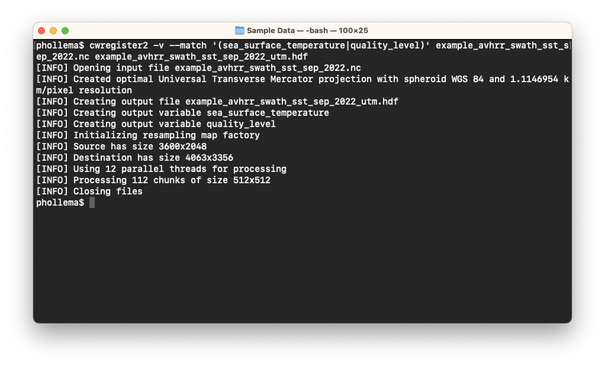
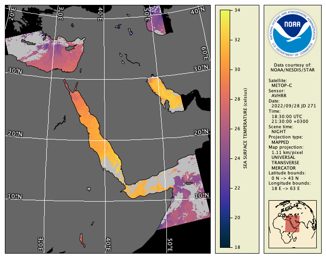

# Registration to a Map Projection (cwregister2)

The **cwregister2** tool resamples a data file to a new data grid, converting the data from [level 2 to level 3](https://en.wikipedia.org/wiki/Remote_sensing#Data_processing_levels) or from one level 3 map projection to another. After resampling to a common grid, data from heterogeneous sources can be inter-compared and combined. The destination data grid is a [map projection](https://en.wikipedia.org/wiki/Map_projection) such as geographic (equally spaced lat/lon), Mercator, polar stereographic, Universal Transverse Mercator (UTM), etc.

Use the following command to register the AVHRR SST data file from its native level 2 swath projection to a level 3 UTM map projection:

`cwregister2 -v --match '(sea_surface_temperature|quality_level)' example_avhrr_swath_sst_sep_2022.nc example_avhrr_swath_sst_sep_2022_utm.hdf`

You should see the registration running in verbose mode as follows:

The default for **cwregister2** is to output a UTM projection and resolution that matches the source data. View the output file in CDAT, or render it as follows:

`cwrender --enhance sea_surface_temperature --units celsius --range 18/34 --palette Ocean-thermal --coast black/gray40 --grid white --exprmask 'quality_level < 5'/gray example_avhrr_swath_sst_sep_2022_utm.hdf example_avhrr_swath_sst_sep_2022_utm.png`

You'll see the following image:

Try the following options in **cwregister2** one at a time and view the output data file again:

  - `--proj geo` — Output to a geographic projection
  - `--proj mercator` — Output to a Mercator projection
  - `--resolution 2` — Use 2 km/pixel in the destination grid

Note that the output file always contains the input data file footprint. You can use the `--master` option to specify a template for a destination grid that is completely independent of the input data file. The **cwmaster** tool described in the next section is a GUI tool for creating master projection templates to be used with **cwregister2**.

###    Bonus exercises:

  - Look at the manual page for **cwregister2** and discover what other options are available. Try making the tool run with only one processor thread.
  - Find out how to make **cwregister2** run in diagnostic mode and the meaning of the diagnostic output.
  - Find out how to make **cwregister2** save the source row and column of each destination pixel. When would you ever use that feature?
  - Remove the `--match` option and view the resulting output file. You may see warning messages about fill values when running **cwregister2**. Why would fill values in level 3 data files be important?

---

[« Previous](Generic-Variable-Math-cwmath.md) · [Next »](Creating-Map-Projections-cwmaster.md)
