# Spatial and Temporal Composites (cwcomposite)

The **cwcomposite** tool combines data variables across multiple data files by computing a value at each pixel: mean, median, minimum, maximum, or latest value. There are generally two scenarios for using **cwcomposite**:

**Case 1** - Spatial composite over a short time period (~ 1 day):
<table>
  <tr>
    <td>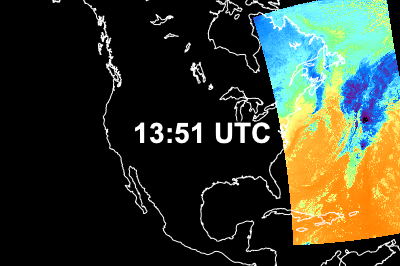</td>
    <td>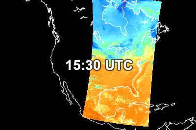</td>
    <td colspan="2" rowspan="2">Spatial composite result: 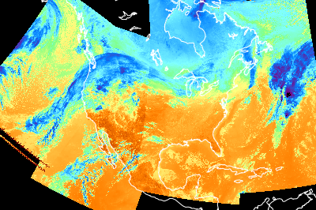</td>
  </tr>
  <tr>
    <td>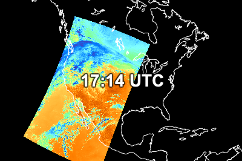</td>
    <td>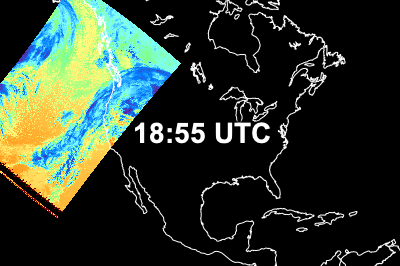</td>
  </tr>
</table>

**Case 2** - Temporal composite over a longer time period (days/weeks/months):

<table>
  <tr>
    <td>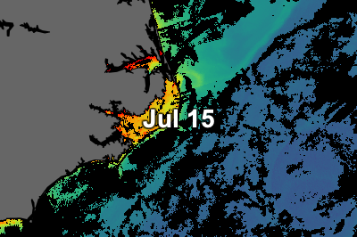</td>
    <td></td>
    <td colspan="2" rowspan="2">Temporal composite result: 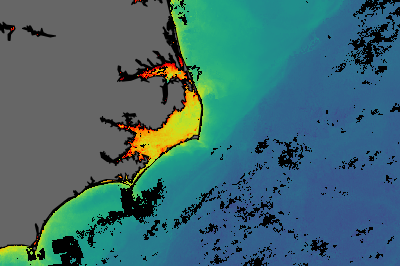</td>
  </tr>
  <tr>
    <td>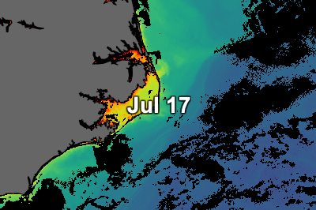</td>
    <td>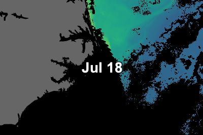</td>
  </tr>
</table>

Type the following command to create a 7-day composite from daily SMAP sea surface salinity data:

`cwcomposite -v --match sss example_smap_salinity_apr_*.nc example_smap_salinity_apr_7day.hdf`

You should see the composite running in verbose mode as follows:

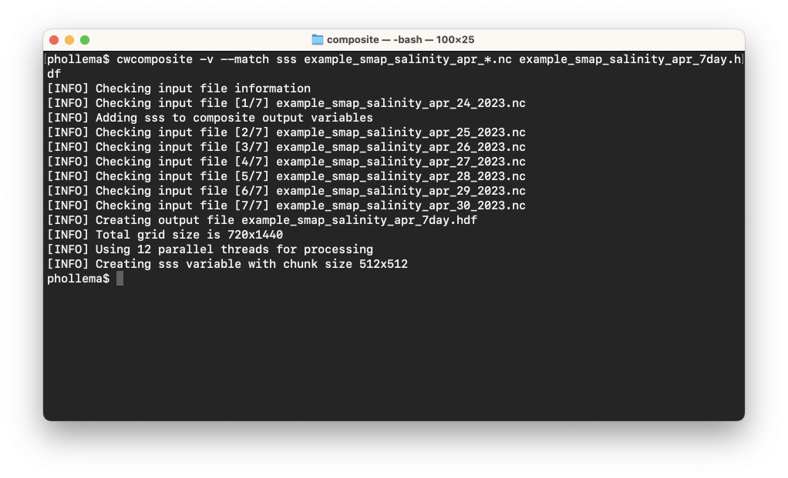

The default for **cwcomposite** is to compute the mean value at each pixel — other composite methods are set using the `--method` option. You can view the output file in CDAT, or render it as follows:

`cwrender --enhance sss --range 30/40 --palette Ocean-haline --grid white --coast black/gray40 example_smap_salinity_apr_7day.hdf example_smap_salinity_apr_7day.png`

You should see the following image:

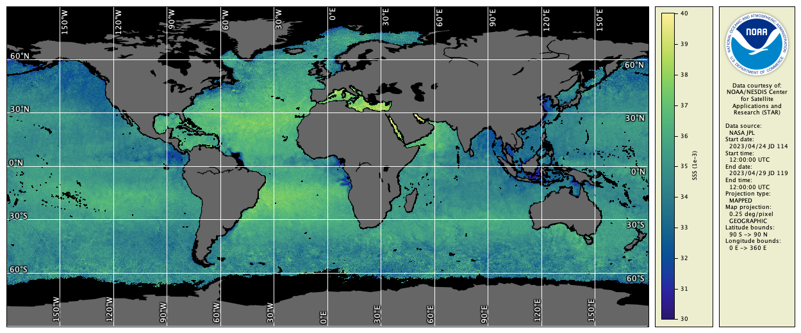

###    Bonus exercises:

  - Read the **cwcomposite** Unix man page or user's guide section. 
  - Add an option to the **cwcomposite** command line to compute the minimum value at each pixel.
  - Find out how to make **cwcomposite** mark a pixel invalid if the number of valid input values at the pixel is less than 5.
  - Suppose a researcher asked for an uninterrupted image of the Pacific Ocean. Try using **cwmaster** and **cwregister2** from the previous exercises to create one, for example:  
  
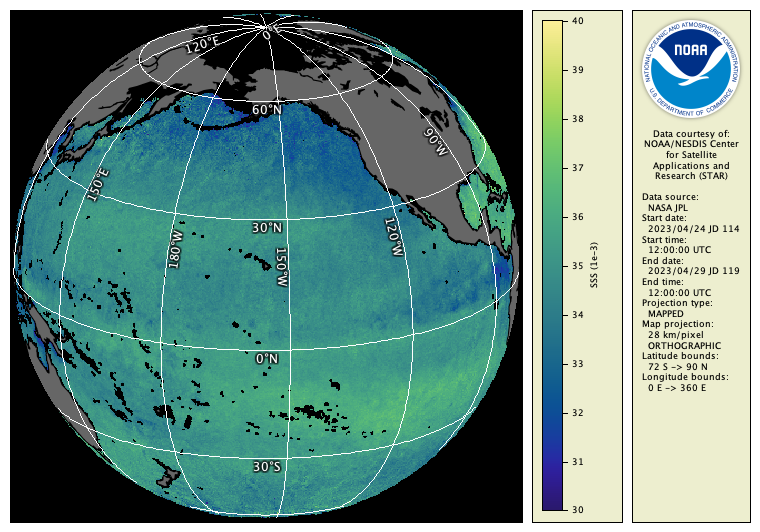

---

[« Previous](Creating-Map-Projections-cwmaster.md) · [Next »](Direct-Software-Library-Access-cwscript.md)
